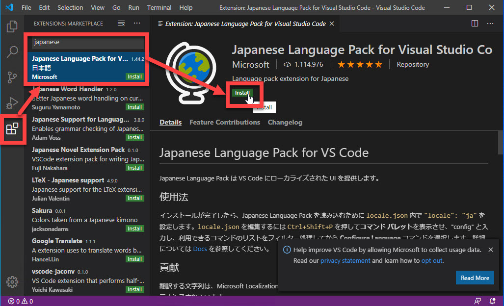

# 開発環境の構築

最初に開発に必要な環境を構築します。

Azure IoT Edge + Custom Vision アプリケーションを開発するには、以下のツールのインストールが必要です。

[0. 開発用 PC の条件](#%e9%96%8b%e7%99%ba%e7%94%a8-pc-%e3%81%ae%e6%9d%a1%e4%bb%b6)  
[1. Visual Studio Code](#visual-studio-code)  
[2. Azure IoT Tools](#azure-iot-tools)  
[3. Docker Desktop](#docker-desktop)  
[4. (オプション) Anaconda](#anaconda)

> ここでは Windows 環境のみ記載しています。  
> Windows 以外の OS での動作確認は行っていません。

---

## 開発用 PC の条件

IoT Edge 開発では **Docker Desktop** が動作する必要があります。

Windows 10 の場合は

- Hyper-V が動作する PC
- Windows 10 Pro 以上（Home は使用不可）
- メモリ 16GB 程度以上

が必要です。  
開発時には Visual Studio Code および Docker Desktop が同時に起動している必要があるため、マシンスペックによっても開発が困難または不可能なことがあります。

Windows 以外の場合でも Visual Studio Code + Docker Desktop が必要です。こちらも十分なスペックのマシンが必要です。

> マシンを用意できない場合は、**Azure 上に仮想マシンを作成** してハンズオンを進めることができます。
>
> 仮想マシンで Hyper-V を有効にするには [**Dv3 または Ev3 の仮想マシン**](https://docs.microsoft.com/ja-jp/azure/virtual-machines/windows/nested-virtualization) が必要です。  
> "Standard D4s_v3" などの Windows 10 仮想マシンを作成して、Visual Studio Code のインストールから実施してください。
>
> なお 2020年4月時点では Dv3 または Ev3 の仮想マシンを作成した後に、以下の Hyper-V の有効化コマンドの実行は不要なようです。
>
> ```powershell
> # Windows Server の場合
> Install-WindowsFeature -Name Hyper-V -IncludeManagementTools -Restart
> ```
>
> または
>
> ```powershell
> # Windows 10 の場合
> Enable-WindowsOptionalFeature -Online -FeatureName Microsoft-Hyper-V -All -Restart
> ```
>
> もし Docker Desktop の起動時にエラーメッセージが表示されるようであれば、一度 Docker Desktop をアンインストールしてから上記の Hyper-V 有効化コマンドを実行してください。

---

## Visual Studio Code

[Visual Studio Code](https://code.visualstudio.com/) で Visual Studio Code のインストーラーをダウンロードします。

インストール完了後に Visual Studio Code 起動を確認したら、必要に応じて "Japanese Language Pack" をダウンロードします。




---

## Azure IoT Tools

[Azure IoT Tools](https://marketplace.visualstudio.com/items?itemName=vsciot-vscode.azure-iot-tools) をインストールします。  

Azure IoT Tools は Visual Studio Code の拡張機能で、Azure IoT (IoT Hub, IoT Edge) 開発に必要なツールです。


インストールが完了してから Visual Studio Code を再起動すると "**AZURE IOT HUB**" メニューが表示されます。


---

## Docker Desktop

IoT Edge モジュールを開発するには、開発用 PC に Docker Desktop が必要です。

[Docker Desktop のダウンロード ページ](https://www.docker.com/products/docker-desktop) からダウンロードして、インストールします。


OS の再起動後に Docker Desktop が起動すればインストール完了です。


---

## Anaconda

Anaconda または Python は、このハンズオンでは必須ではありません。  

ただし同様のアプリケーションを開発する場合は、Python のコードを編集したりデバッグしたりする必要が出てきます。  
ここで一緒に [インストール](https://www.anaconda.com/distribution/#download-section) することをお勧めします。

---

以上で、アプリケーション開発に必要な環境が構築できました。

次は Custom Vision で画像分類器を作成します。

[次に進む](./02_custom_vision.md)  
[目次に戻る](../README.md)