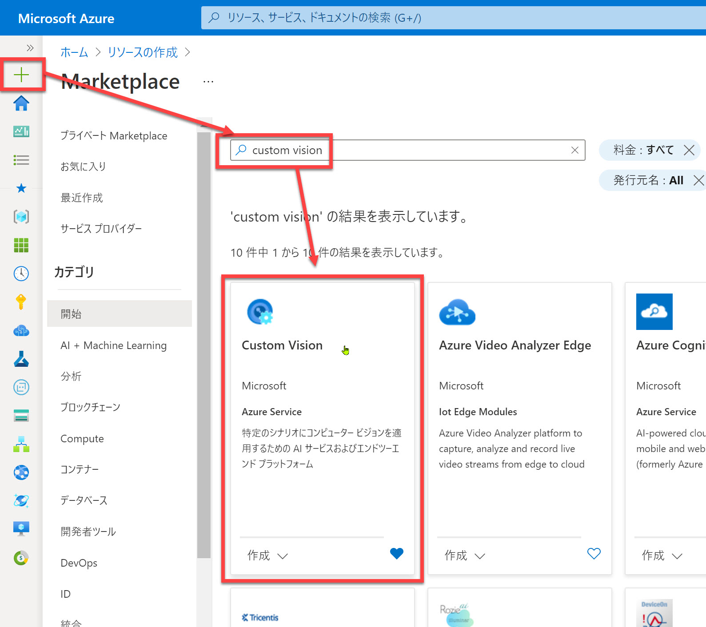
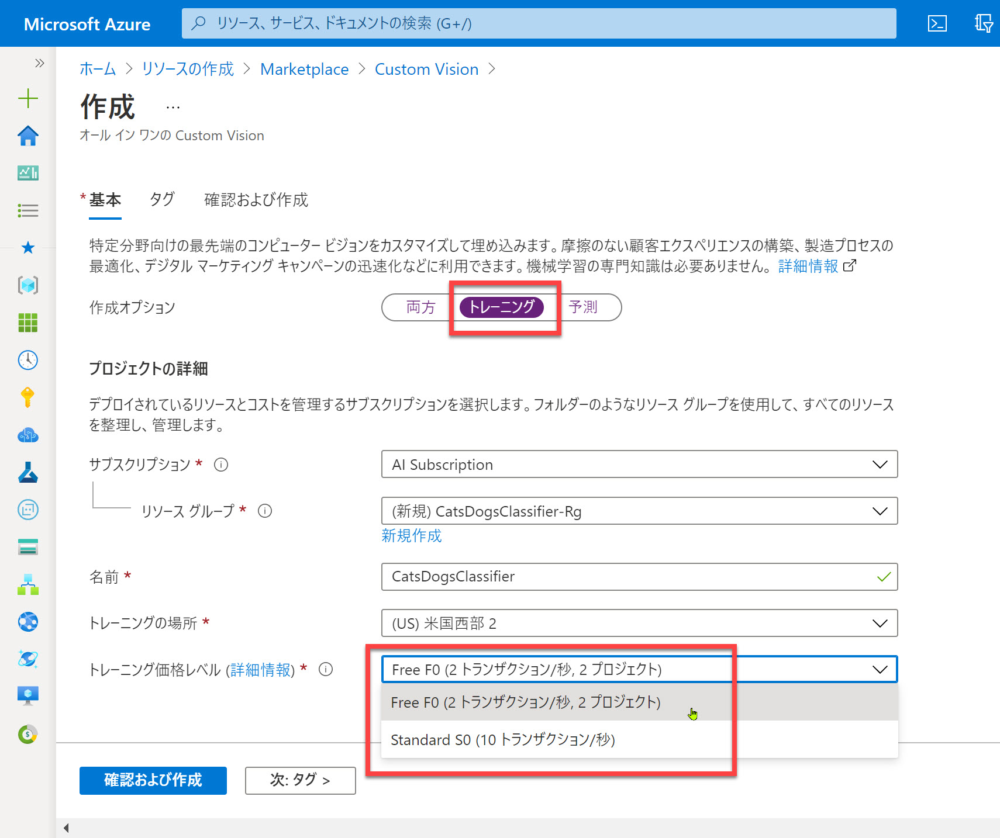
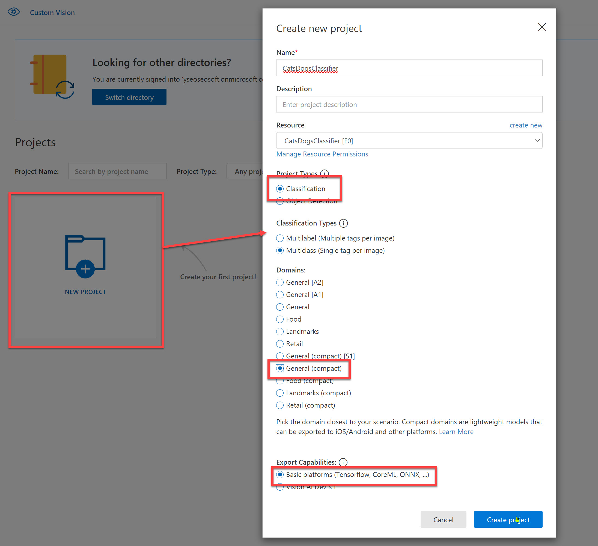
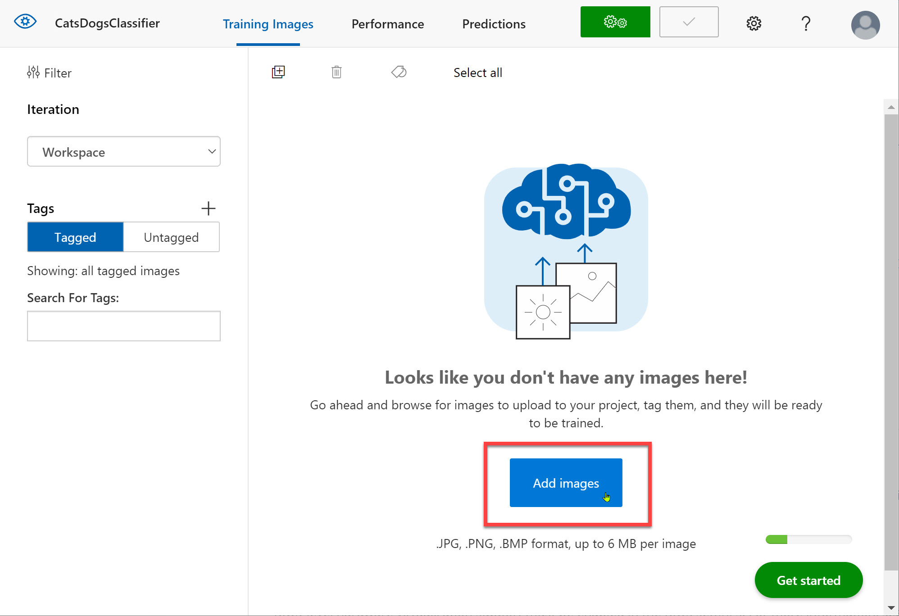
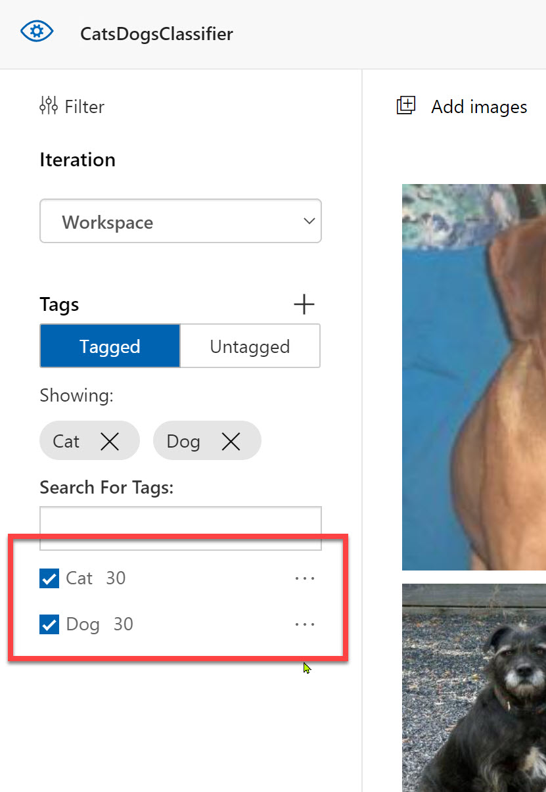
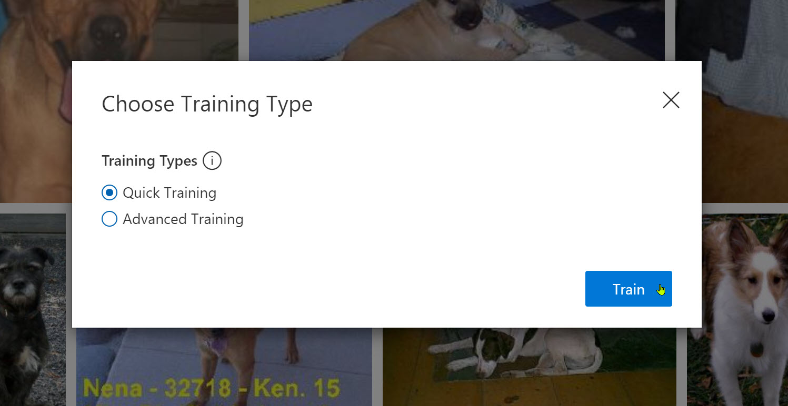
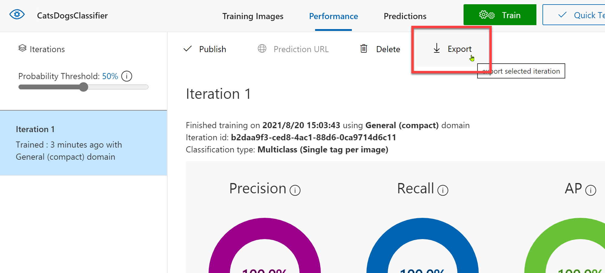

# Custom Vision で画像分類器の作成

[**Custom Vision**](https://www.customvision.ai/) で画像分類器を作成します。

[1. 教師データを用意](#%e6%95%99%e5%b8%ab%e3%83%87%e3%83%bc%e3%82%bf%e3%82%92%e7%94%a8%e6%84%8f)
[2. Custom Vision で画像分類器を作成](#custom-vision-%e3%81%a7%e7%94%bb%e5%83%8f%e5%88%86%e9%a1%9e%e5%99%a8%e3%82%92%e4%bd%9c%e6%88%90)  
[3. Azure ポータルで Custom Vision のリソース作成](#azure-%e3%83%9d%e3%83%bc%e3%82%bf%e3%83%ab%e3%81%a7-custom-vision-%e3%81%ae%e3%83%aa%e3%82%bd%e3%83%bc%e3%82%b9%e4%bd%9c%e6%88%90)  
[4. Custom Vision ポータルでプロジェクト作成](#custom-vision-%e3%83%9d%e3%83%bc%e3%82%bf%e3%83%ab%e3%81%a7%e3%83%97%e3%83%ad%e3%82%b8%e3%82%a7%e3%82%af%e3%83%88%e4%bd%9c%e6%88%90)  
[5. 画像データをアップロード](#%e7%94%bb%e5%83%8f%e3%83%87%e3%83%bc%e3%82%bf%e3%82%92%e3%82%a2%e3%83%83%e3%83%97%e3%83%ad%e3%83%bc%e3%83%89)  
[6. トレーニング](#%e3%83%88%e3%83%ac%e3%83%bc%e3%83%8b%e3%83%b3%e3%82%b0)  
[7. モデルのエクスポート](#%e7%94%bb%e5%83%8f%e3%83%87%e3%83%bc%e3%82%bf%e3%82%92%e3%82%a2%e3%83%83%e3%83%97%e3%83%ad%e3%83%bc%e3%83%89)

---

Custom Vision の主な特徴は以下の通りです。

- ブラウザー上の簡単な操作で、高品質な画像分類器を作成できる
- 教師データは一般的な深層学習モデル開発と比べると少数でかまわない
- Docker ファイルなどの形式で学習モデルをエクスポートできる

このハンズオンでは分類器の例として、**猫と犬とを分類** するモデルを作成します。  
教師データとして [Kaggle の Dogs & Cats Images](https://www.kaggle.com/chetankv/dogs-cats-images) を使用します。

> データセットには多数の画像が含まれますが、以下の手順では猫・犬の画像それぞれ 30枚を教師データとします。  

---

## 教師データを用意

ここでは教師データとして "Kaggle の Dogs & Cats Images" を使用します。

1. [Dogs & Cats Images](https://www.kaggle.com/chetankv/dogs-cats-images) のデータセットをダウンロードします。

2. ZIP ファイルの "dog vs cat\dataset\training_set" 内の "cats" フォルダーおよび "dogs" フォルダーからそれぞれ30枚程度、合計60枚程度の画像を展開しておきます。  
   予測のエミューレーションで使用するテストデータもここで取り出しておきます。  
   "dog vs cat\dataset\test_set" 内の "cats" フォルダーおよび "dogs" フォルダーからそれぞれ3枚、合計6枚の画像を展開しておきます。

   

3. テストデータについては、"test_image_0.jpg" ～ "test_image_5.jpg" とリネームしておきます。

---

## Azure ポータルで Custom Vision のリソース作成

最初に Azure ポータルで Custom Vision のリソースを作成します。

1. [**Azure ポータル**](https://portal.azure.com/) を開いて [リソースの作成] を選択して、検索ボックスに "custom vision" と入力。続いて、[Custom Vision] を選択。  

   

2. 今回はトレーニングした学習モデルをエクスポートして使用するので、クラウドでの予測は不要です。  

   - [作成オプション] では "**トレーニング**" を選択します。  
   - 名前は今回は "**CatsDogsClassifier**" とします。
   - [トレーニング価格レベル] は選択可能なら "F0" を選択、そうでなければ "S0" を選択します。

    
   

---

## Custom Vision ポータルでプロジェクト作成

1. [**Custom Vision ポータル**](https://www.customvision.ai/) を開いてサインインします。  
2. [**NEW PROJECT**] をクリックして新しいプロジェクトを作成します。  
   以下の入力・選択をしたら、最後に [**Create project**] をクリックします。

   |項目名|入力・選択|説明|
   |---|---|---|
   |Name|ここでは "CatsDogsClassifier"| |
   |Resources|Azure で作成した Custom Vision のリソース| |
   |Project Types|Classification|画像分類|
   |Classification Types|Multiclass|画像ごとに一つタグ付け|
   |Domains|General (compact)|モデルをエクスポートするには "compact"|
   |Export Capabilities|Basic platform|Docker ファイルエクスポートは "Basic platform"|

    
   

---

## 画像データをアップロード

プロジェクトができたので、画像ファイルをアップロードします。

1. [**Add images**] をクリックして、教師データの猫のデータを選択します。

   

2. タグとして "**Cat**" と入力して [Upload 30 files] をクリックします。

   

3. [Add Images] をクリックして、教師データの犬のデータを選択します。  
   タグとして "**Dog**" と入力して [Upload 30 files] をクリックします。

   

4. 合計 60枚の画像ファイルがタグ付けされてアップロードされたことを確認します。

   

---

## トレーニング

アップロードしたデータを学習します。

1. [**Train**] をクリックして学習を開始します。

   

2. [Training Types] として今回は "Quick Training" を選択して [Train] をクリックします。

   

3. 学習の結果が表示されます。  
   以下の図だと、92% 程度の正確性 (猫・犬を92%程度正しく分類できる) のモデルであることが分かります。

   

Custom Vision では、これだけで画像分類器が完成です。

> 実案件ではモデルの品質の検証や再学習の検討が必要です。  
> ここでは手順の理解を目的としているので、トレーニングについてはここまでとします。

---

## モデルのエクスポート

Custom Vision の学習モデルは非常に簡単に作れたので、続いてモデルをエクスポートします。

1. [Performances] の [**Export**] をクリックします。

   

2. エクスポートのフォーマット選択（プラットフォームの選択）で "**Dockerfile**" を選択します。

   

3. プラットフォームとして "**Linux**" を選択します。

   

4. [Download] をクリックします。

   

5. ダウンロードされた ZIP ファイルの中身を確認してみます。  
   - "app" フォルダー
   - "azureml" フォルダー
   - Dockerfile
   - README.txt

    
   

---

以上で Custom Vision で画像分類器を作成して、学習モデルをエクスポートしました。  
簡単な手順で学習できることが分かったと思います。

次から Visual Studio Code を使って、IoT Edge デバイスで動作するアプリケーションを作っていきます。

[前に戻る](./01_install.md) | [次に進む](./03_create_edgeapp.md)  
[目次に戻る](../README.md)