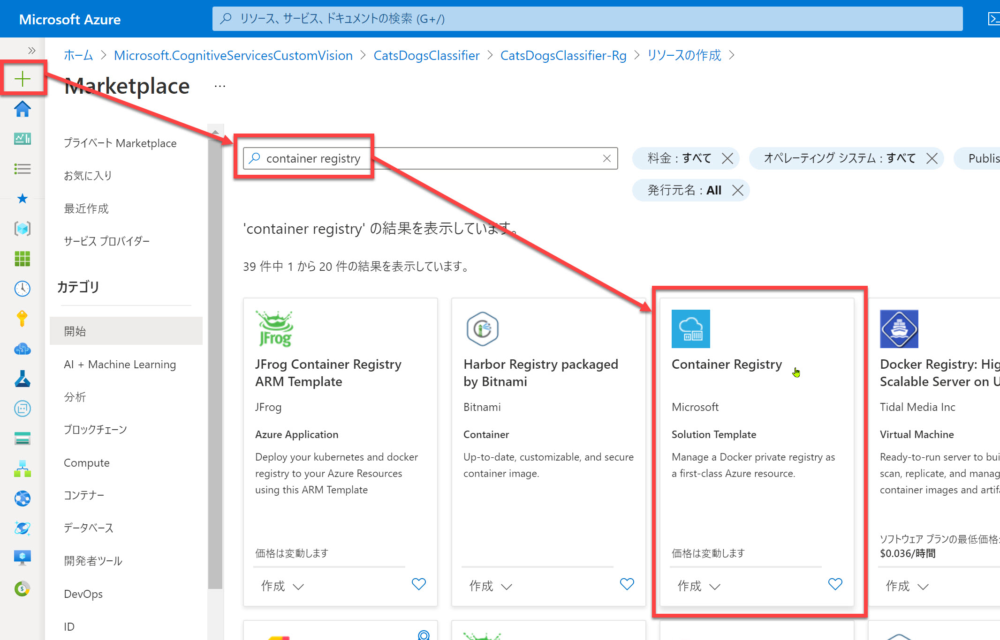
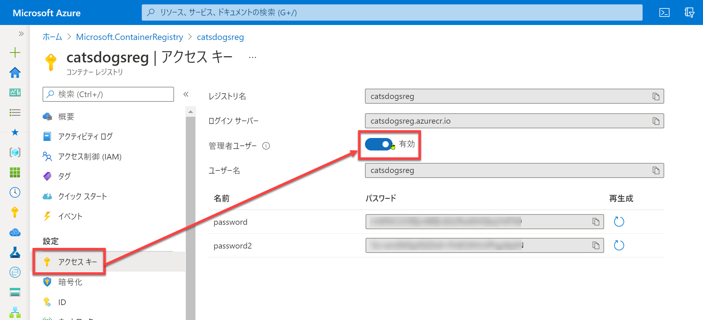
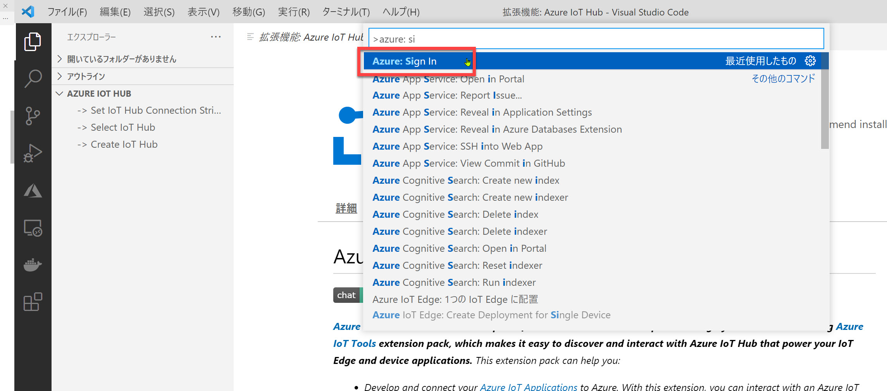
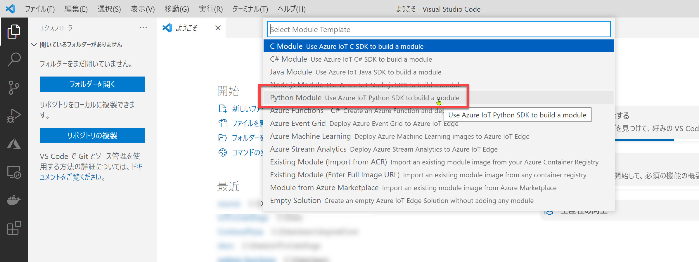
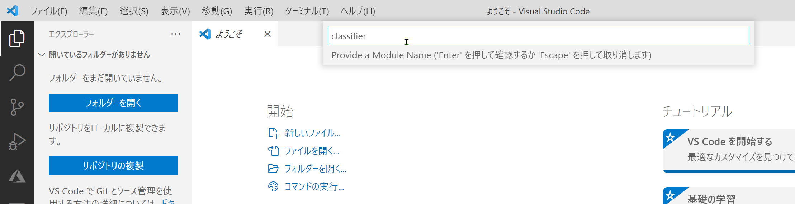
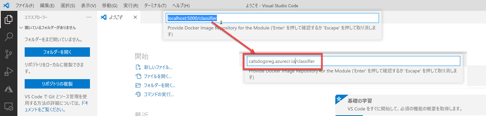
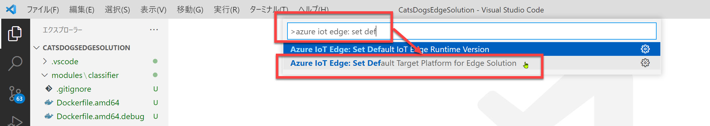

# IoT Edge ソリューションの作成

ここから IoT Edge ソリューションを作成していきます。

[1. Azure Container Registry 作成](#azure-container-registry-%e4%bd%9c%e6%88%90)  
[2. Visual Studio Code で Azure にサインイン](#visual-studio-code-%e3%81%a7-azure-%e3%81%ab%e3%82%b5%e3%82%a4%e3%83%b3%e3%82%a4%e3%83%b3)  
[3. ソリューション作成](#%e3%82%bd%e3%83%aa%e3%83%a5%e3%83%bc%e3%82%b7%e3%83%a7%e3%83%b3%e4%bd%9c%e6%88%90)  
[4. classifier モジュールの更新](#classifier-%e3%83%a2%e3%82%b8%e3%83%a5%e3%83%bc%e3%83%ab%e3%81%ae%e6%9b%b4%e6%96%b0)  
[5. カメラモジュールを追加](#%e3%82%ab%e3%83%a1%e3%83%a9%e3%83%a2%e3%82%b8%e3%83%a5%e3%83%bc%e3%83%ab%e3%82%92%e8%bf%bd%e5%8a%a0)  
[6. マニフェストファイルの更新](#%e3%83%9e%e3%83%8b%e3%83%95%e3%82%a7%e3%82%b9%e3%83%88%e3%83%95%e3%82%a1%e3%82%a4%e3%83%ab%e3%81%ae%e6%9b%b4%e6%96%b0)  
[7. ソリューションの設定](#%e3%82%bd%e3%83%aa%e3%83%a5%e3%83%bc%e3%82%b7%e3%83%a7%e3%83%b3%e3%81%ae%e8%a8%ad%e5%ae%9a)

IoT Edge デバイスで動作するモジュール（独立した機能を持つプログラムの単位）は、[**Azure Container Registry**](https://azure.microsoft.com/ja-jp/services/container-registry/) に対して、Docker イメージの形でアップロードして管理します。

このセクションでは、Container Registry の作成から IoT Edge ソリューションの作成まで行います。

---

## Azure Container Registry 作成

1. [Azure ポータル](https://portal.azure.com/) で "**Container Registry**" を新規作成します。

   

2. 作成のための情報を入力・選択します。  

   - [**レジストリ名**] は以下では "catsdogsreg" としていますが、**一意な名前** が求められるため、自分の名前や日付を組み合わせるなど適宜変更してください。
   - [**管理者ユーザー**] は "**有効**" にします。これはあとで Docker イメージのアップロードするためにログインする必要があるため。  
   - [**SKU**] は今回は "**Basic**" で十分です。これは今回はリポジトリは1個でいいため。

    
   

3. Container Registry が作成されたら、[**アクセスキー**] で以下を確認します。  
   あとの手順で必要なので、メモ帳などにコピーしておきます。

   - レジストリ名
   - ログイン サーバー
   - ユーザー名
   - password

    
   

---

## Visual Studio Code で Azure にサインイン

Azure との連携が多く発生するので、ソリューションを作成する前に Visual Studio Code で Azure にサインインしておきます。

1. Visual Studio Code を起動します。
2. [**コマンドパレット**] を開きます。(Ctrl + Shift + P または [表示] - [コマンドパレット])
3. "**Azure: Signin**" を選択してサインインします。

   

4. Visual Studio Code のステータスバーで Azure にサインインしたことを確認します。

   

---

## ソリューション作成

Visual Studio Code で IoT Edge ソリューションを作成します。

1. Visual Studio Code の [コマンドパレット] で "**Azure IoT Edge: New IoT Edge Solution**" を選択します。

   

2. ソリューションを作成するフォルダーを選択します。
3. ソリューション名を入力します。  
   ここでは "**CatsDogsEdgeSolution**" とします。

   

4. [Select Module Template] で "**Python Module**" を選択します。  
   Custom Vision からエクスポートしたファイルが Python で記述されたものだからです。  
   あとの手順で、ここで作成するモジュールに Custom Vision のエクスポートファイルをコピーします。

   

5. モジュール名を入力します。  
   ここでは "**classifier**" とします。  
   あとの手順の都合で、全て小文字で入力します。  
   このモジュールは、Custom Vision の学習モデルを利用する予測サービスのひな形として、あとの手順で使用します。

   

6. [**Provide Docker Image Repository for the Module**] を編集します。  
   初期値は "localhost:5000/classifier" ですが、これを "**<ACR ログインサーバー名>/classifier**" に変更します。  

   

7. ソリューションのひな形が生成されます。

   

---

## ソリューションの設定

1. "Please set container registry credentials to .env file" メッセージが表示されることがあります。  
   あとの手順で ".env" ファイルを確認するので "Yes" で閉じてかまいません。

   

2. [コマンドパレット] で "**Azure IoT Edge: Set Default Target Platform for Edge Solution**" を選択します。  
    今回は "**amd64**" を選択します。

   
   

3. ".env" ファイルを開きます。  
   ACR のユーザー名、パスワードが登録済みであればそのままでかまいません。  
   空欄になっている場合は、ACR 作成時に記録した値を入力します。

   

---

以上で IoT Edge ソリューションを新規作成してアプリケーションを作成する準備ができました。  
ここまでのステップではソリューションの "枠組み" ができたの状態です。

次のステップから、コードの追加・編集などを行ってアプリケーションを開発していきます。

[前に戻る](./02_custom_vision.md) | [次に進む](./04_edit_classfier.md)  
[目次に戻る](../README.md)