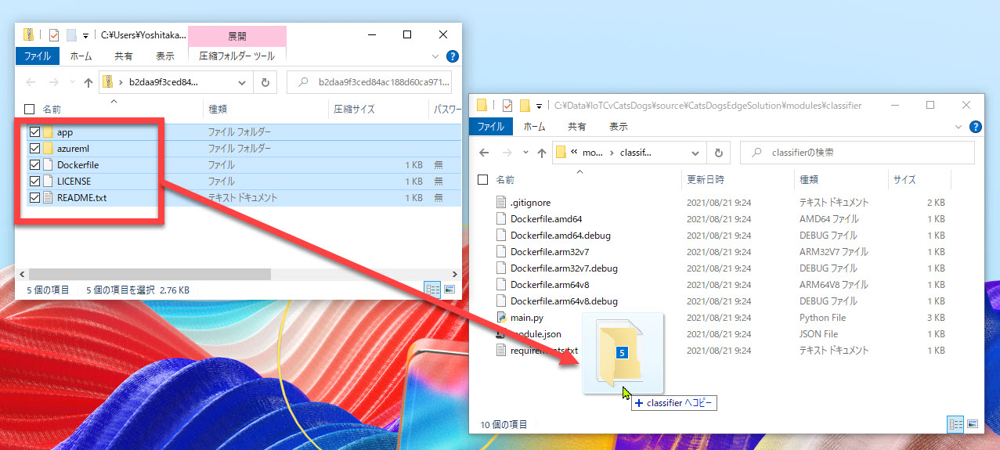

# 予測サービスモジュールの編集

[前のステップ](./03_create_edgeapp.md) で IoT Edge ソリューションのひな形を作成しました。  
続いて **モジュールの開発** を行います。  

モジュールは2つ作りますが、最初は **予測サービスモジュール** を開発します。

このモジュールは、前の手順でソリューションを作成した時に一緒に作成した "classifier" モジュールを利用します。  

[1. Custom Vision のエクスポートファイルをコピー](#custom-vision-%e3%81%ae%e3%82%a8%e3%82%af%e3%82%b9%e3%83%9d%e3%83%bc%e3%83%88%e3%83%95%e3%82%a1%e3%82%a4%e3%83%ab%e3%82%92%e3%82%b3%e3%83%94%e3%83%bc)  
[2. classfier の module.json を編集](#classfier-%e3%81%ae-modulejson-%e3%82%92%e7%b7%a8%e9%9b%86)  
[3. (オプション) 不要なファイルの削除](#%e3%82%aa%e3%83%97%e3%82%b7%e3%83%a7%e3%83%b3-%e4%b8%8d%e8%a6%81%e3%81%aa%e3%83%95%e3%82%a1%e3%82%a4%e3%83%ab%e3%81%ae%e5%89%8a%e9%99%a4)

---

## Custom Vision のエクスポートファイルをコピー

[Custom Vision でエクスポートしたファイル](./02_custom_vision.md) を "classifier" モジュールフォルダーにコピーします。

1. Custom Vision でエクスポートした ZIP ファイルをエクスプローラーで開きます。
2. 前の手順で作成した "CatsDogsEdgeSolution" ソリューションの "modules\classfier" フォルダーをエクスプローラーで開きます。
3. ZIP ファイル内のフォルダー2つ、ファイル2つをすべて "classfier" フォルダーにコピーします。

   

   > 実際には "README.txt" はこのハンズオンではコピー不要です。  
   > エクスポートしたファイル群を使った 予測 Web サービスの参考情報が載っているため、今回はコピーしました。  
   > 余裕のある時に目を通すことをお勧めします。

4. Visual Studio Code でもファイル一覧が更新されていることを確認します。

   

---

## classfier の module.json を編集

"classfier" モジュールの "module.json" を編集します。

このファイルは Docker パッケージのビルドで使用する Dockerfile が指定されています。  
今回の IoT Edge モジュールを作成するには Custom Vision の ZIP ファイルからコピーした "Dockerfile" だけを使用します。

1. Visual Studio Code で "**modules\classfier\module.json**" を開きます。
2. "**platforms**" を以下のように変更する。

   ```json
   "platforms": {
     "amd64": "./Dockerfile"
   }
   ```

   

   > 参考として、変更前の "platforms" パラメーターは以下の通りです。
   >
   > ```json
   > "platforms": {
   >   "amd64": "./Dockerfile.amd64",
   >   "amd64.debug": "./Dockerfile.amd64.debug",
   >   "arm32v7": "./Dockerfile.arm32v7",
   >   "arm32v7.debug": "./Dockerfile.arm32v7.debug",
   >   "arm64v8": "./Dockerfile.arm64v8",
   >   "arm64v8.debug": "./Dockerfile.arm64v8.debug"
   > }
   > ```

---

## (オプション) 不要なファイルの削除

オプションの手順として、不要なファイルを削除します。  
この手順を実施しなくても、モジュールの動作には支障ありません。

不要なファイルが残っているのが気になる場合は、"modules/classfier" フォルダーから以下のファイルを削除します。

- Dockerfile.amd64
- Dockerfile.amd64.debug
- Dockerfile.arm32v7
- Dockerfile.arm32v7.debug
- Dockerfile.arm64v8
- Dockerfile.arm64v8.debug
- main.py


---

以上で、予測サービスモジュールの編集は終了です。

Custom Vision は、学習モデルと Web サービスとして動作するコードを含んだファイルをエクスポートしてくれます。  
それを活用することで予測サービスモジュールは、ファイルコピーと module.json の編集だけで済みました。

次のステップでは、ソリューションにカメラモジュール（今回はカメラシミュレーター）

[前に戻る](./03_create_edgeapp.md) | [次に進む](./05_create_cameramodule.md)
[目次に戻る](../README.md)