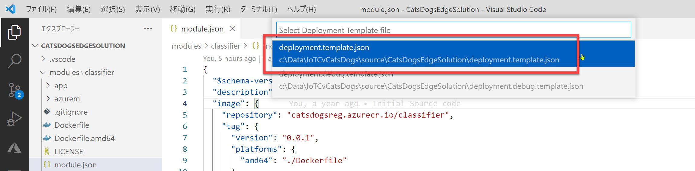
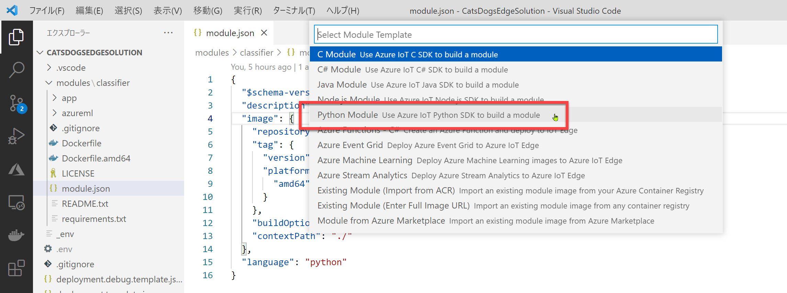
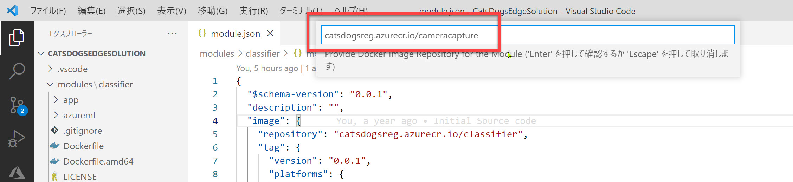
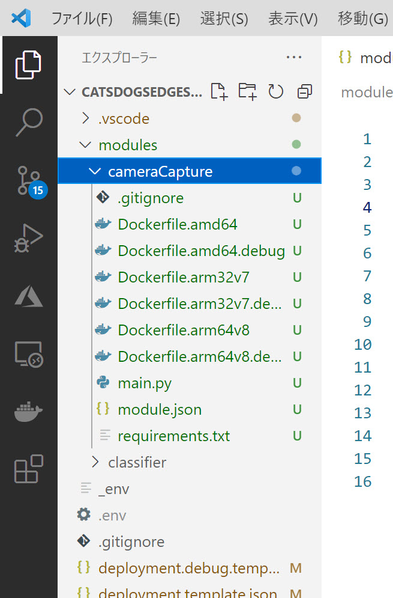
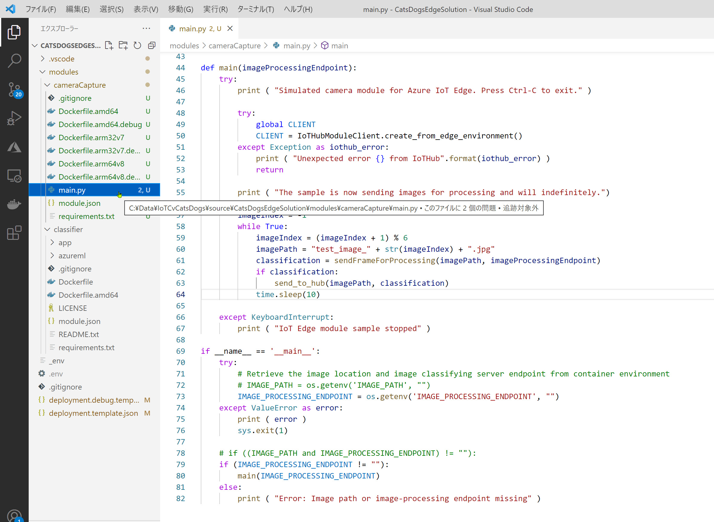
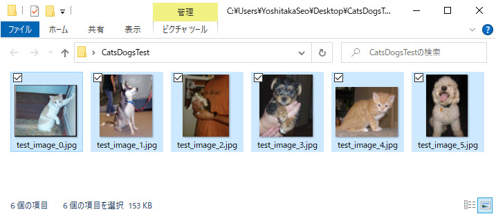
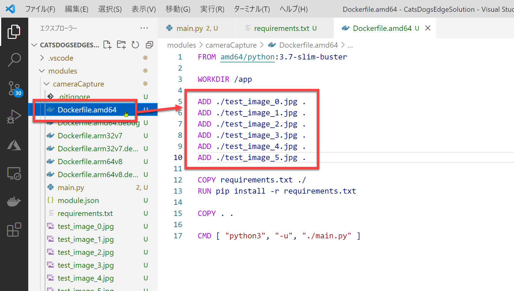

# カメラモジュールの作成

[前のステップ](./04_edit_classfier.md) で、画像分類の予測サービスモジュールを編集しました。  
予測サービスモジュールは Custom Vision からエクスポートしたファイルを活用するため、非常に簡単に作業できました。

このステップでは **カメラモジュールを作成** します。

> カメラモジュールはシミュレーターなので物理デバイスは不要です。Azure と PC だけで実現できます。  
> (PC のカメラも使用しません)

<br />

[1. カメラモジュールの追加](#%e3%82%ab%e3%83%a1%e3%83%a9%e3%83%a2%e3%82%b8%e3%83%a5%e3%83%bc%e3%83%ab%e3%81%ae%e8%bf%bd%e5%8a%a0)  
[2. main.py の編集](#mainpy-%e3%81%ae%e7%b7%a8%e9%9b%86)  
[3. 使用するライブラリの追加](#%e4%bd%bf%e7%94%a8%e3%81%99%e3%82%8b%e3%83%a9%e3%82%a4%e3%83%96%e3%83%a9%e3%83%aa%e3%81%ae%e8%bf%bd%e5%8a%a0)  
[4. テスト画像の追加](#%e3%83%86%e3%82%b9%e3%83%88%e7%94%bb%e5%83%8f%e3%81%ae%e8%bf%bd%e5%8a%a0)

<br />

---

## カメラモジュールの追加

ソリューションにカメラモジュールを追加します。

1. Visual Studio Code の [コマンドパレット] (Ctrl + Shift + P) で "**Add IoT Edge Module**" を選択します。

   

<br />

2. [**Select Deployment Template file**] ではデフォルトで表示されている "**deployment.template.json**" を選択します。

   

<br />

3. [**Selct Module Template**] では "**Python Module**" を選択します。

   

<br />

4. モジュール名を入力します。今回は "**cameraCapture**" とします。

   

<br />

5. [**Provide Docker Image Repository for the Module**] を編集します。  
   "**<ACR ログインサーバー名>/cameracapture**" とします。

   

<br />

6. "cameraCapture" モジュールが追加されたことを確認します。  

   

<br />

---

## main.py の編集

モジュールの処理本体である **main.py** を編集します。

<br />

1. "**cameraCapture**" の "**main.py**" を開きます。  
   （"classifier" の main.py ではありません）

   > main.py を開くと Visual Studio Code が Python 関連の拡張機能のインストールを勧めてくるかもしれません。  
   > このハンズオンを実施するためには不要ですが、ここでインストールしても問題ありません。

<br />

2. main.py 全体を [**このリポジトリ内の "source/modules/cameraCapture/main.py"**](../source/modules/cameraCapture/main.py) で置換します。

   

<br />

いくつかポイントを紹介します。

- 20行目付近 (send_to_hub):  
IoT Hub (IoT Edge デバイスとクラウドとのゲートウェイとなるサービス) にメッセージを送信します。それと合わせて、モジュール自体のログに予測に使用したファイル名を出力します。

- 58行目付近 (main の while ループ):  
ファイル名を決めて、classifier Web サービスに対して画像分類予測のリクエストを送信します。結果は send_to_hub に渡します。画像は 10秒毎に別の画像で予測します。  
(6枚の画像を順に使用するコードです)

- 73行目付近 (IMAGE_PROCESSING_ENDPOINT の代入):  
IoT Edge の環境変数の取得のサンプルです。ここでは具体的に ciassifier Web サービスの URL を取得しています。

<br />

---

## 使用するライブラリの追加

"cameraCapture" モジュールは classfier Web サービスに HTTP リクエストします。  
このため Docker イメージをビルドする際にライブラリを含められるようにします。

1. "cameraCapture" の "**requirements.txt**" 開きます。
2. 2行目に "**requests**" を追加します。  
   （1行目を削除しないように注意してください）

   

<br />

---

## テスト画像の追加

このハンズオンでは、物理的なエッジデバイスやカメラを使用しません。  
画像分類するための画像は、テスト用の画像ファイルを使用することにします。

1. Custom Vision の教師データとした "Dogs & Cats Images" の ZIP ファイルで、"**dataset\test_set**" フォルダーを開きます。  
   "cats" フォルダーおよび "dogs" フォルダーから合計 6枚のファイルを任意にコピーします。
2. "**test_iamge_0.jpg**" ～ "**test_image_5.jpg**" にリネームします。  
   main.py でテスト画像のファイル名がこれらの名前であることを前提にしています。  
   ファイル名に注意してください。

   

<br />

3. 6枚のテスト画像ファイルを、今回のソリューションの "modules/cameraCapture" フォルダーにコピーします。

   

<br />

4. "cameraCapture" の "**Dockerfile.amd64**" を開きます。  
   "WORKDIR /app" の下に以下のコードを追加します。

   ```txt
   ADD ./test_image_0.jpg .
   ADD ./test_image_1.jpg .
   ADD ./test_image_2.jpg .
   ADD ./test_image_3.jpg .
   ADD ./test_image_4.jpg .
   ADD ./test_image_5.jpg .
   ```

   

<br />

---

以上でカメラモジュールの作成と編集が終わりました。

次のステップでは、Docker イメージをビルドして Azure Container Registry に発行します。

[前に戻る](./04_edit_classfier.md) | [次に進む](./06_upload_to_acr.md)  
[目次に戻る](./README.md)