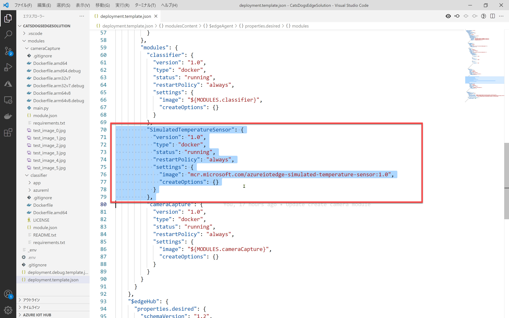
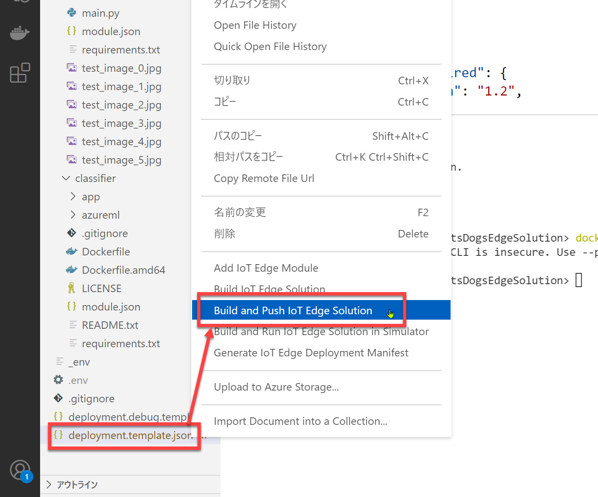
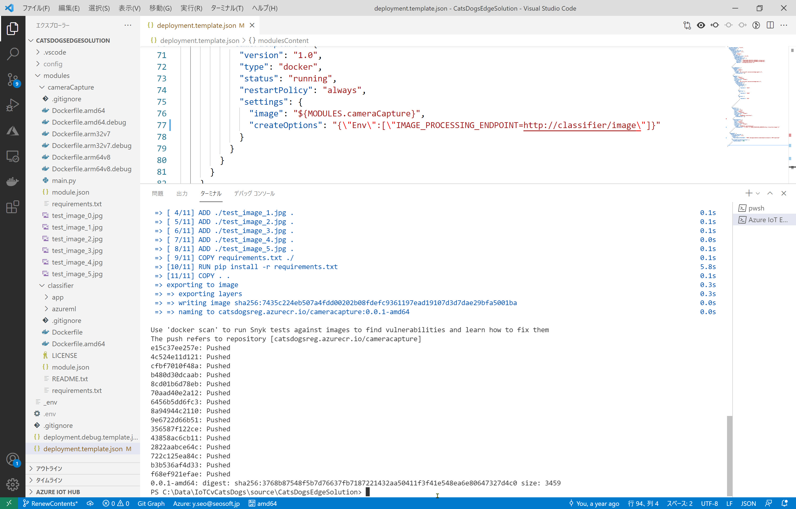
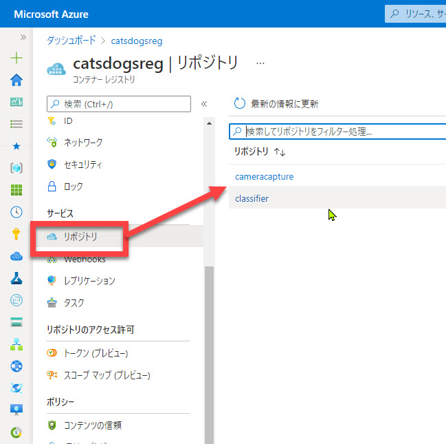

# Container Registry にモジュールをアップロード

[前のステップ](./05_create_cameramodule.md) までで IoT Edge モジュールのコーディングが終わりました。

このステップでは、モジュールの Docker ファイルを Azure Container Registry に発行します。

[1. マニフェストファイルの編集](#%e3%83%9e%e3%83%8b%e3%83%95%e3%82%a7%e3%82%b9%e3%83%88%e3%83%95%e3%82%a1%e3%82%a4%e3%83%ab%e3%81%ae%e7%b7%a8%e9%9b%86)  
[2. ソリューションをビルドして ACR に発行](#%e3%82%bd%e3%83%aa%e3%83%a5%e3%83%bc%e3%82%b7%e3%83%a7%e3%83%b3%e3%82%92%e3%83%93%e3%83%ab%e3%83%89%e3%81%97%e3%81%a6-acr-%e3%81%ab%e7%99%ba%e8%a1%8c)

---

## マニフェストファイルの編集

モジュールを Edge デバイスに配置するためにマニフェストファイル が必要です。  
まにフェイスとファイルはモジュールの配置、起動、実行を Edge デバイスに指示する役割を持ちます。

Visual Studio Code の Azure IoT Tools で作成した IoT Edge ソリューションには、マニフェストファイルのひな形が含まれています。  
これを編集して、今回のソリューション用のマニフェストファイルにします。

1. Visual Studio Code で "deployment.template.json" を開きます。

   

2. "**modules**" セクションの "**SimulatedTemperatureSensor**" をブロックごと削除します。  
   これを削除すると "modules" セクションには、

   - classifier
   - cameraCapture
  
   の2つのモジュールが残ります。

   

   > "SimulatedTemperatureSensor" は、IoT Edge ソリューションにデフォルトで含まれているモジュールです。  
   > 文字通り、温度のシミュレートしたデータを定期的に送信するモジュールです。  
   >
   > 自作のモジュールが期待した通りに動作しない場合などに、SimulatedTemperatureSensor モジュールを使用することで、モジュールの問題か、ソリューションの問題か IoT Hub などのクラウド側の問題かの切り分けができます。  
   > また初めて Azure IoT ソリューションを扱う場合にもサンプルのモジュールとして有用です。

3. "**moduls/cameraCapture**" の "**createOptions**" を以下で置換します。

   環境変数を使用したい場合は、この例のように定義します。
   ここでは、cameraCapture モジュールが環境変数 "IMAGE_PROCESSING_ENDPOINT" を参照すること、その値は画像分類器 classfier の Web サービスの URL であることを意味します。

   ```json
   "createOptions": "{\"Env\":[\"IMAGE_PROCESSING_ENDPOINT=http://classifier/image\"]}"
   ```

   

4. "**$edgeHub**" セクションの "**routes**" を以下で置換します。

   cameraCapture モジュールの全ての出力を、IoT Edge ソリューションからの出力（IoT Hub へのメッセージ送信）にルーティングすることを意味します。

   ```json
   "routes": {
     "CameraCaptureToIoTHub": "FROM /messages/modules/cameraCapture/outputs/* INTO $upstream"
   },
   ```

   
   <br />
   

   > ここで分かる通り、IoT Edge モジュールは、ランタイムが持っているルーティングにメッセージを出力したり入力したりすることで、モジュール間および外部との通信を行います。  
   > 実際のメッセージ送受信や通信エラー発生時のリトライなどはランタイムが行ってくれるので、モジュールは必要なメッセージを入出力することに集中できます。

---

## ソリューションをビルドして ACR に発行

IoT Edge ソリューションの開発、設定が終わりました。

ソリューションをビルドして Azure Container Registry に発行します。

1. Visual Studio Code で **ターミナル** を開きます。  
   "**Ctrl + @**" または [表示] - [ターミナル] で開きます。

2. Docker にログインします。

   ```cmd
   docker login -u <ACRユーザー名> -p <ACRパスワード> <ACRログインサーバー>
   ```

   

3. Visual Studio Code のエクスプローラーで "**deployment.tempate.json**" を右クリックして [Build and Push IoT Edge Solution] を選択します。

   

4. Docker Desktop でパッケージのビルドが実行され、Azure Container Registry に発行されます。

   
   <br />
   

5. 発行に成功すると、Azure ポータルの Container Registry でもリポジトリが登録されていることが分かります。

   

---

以上で、開発したモジュールを Azure Container Registry に発行できました。

次のステップでは、

- IoT Hub 作成
- IoT Edge デバイス登録
- ローカル PC のエミュレーターでのソリューションの実行

をまとめて行います。

[前に戻る](./05_create_cameramodule.md) | [次に進む](./07_create_iothub_edgedevice.md)  
[目次に戻る](./README.md)