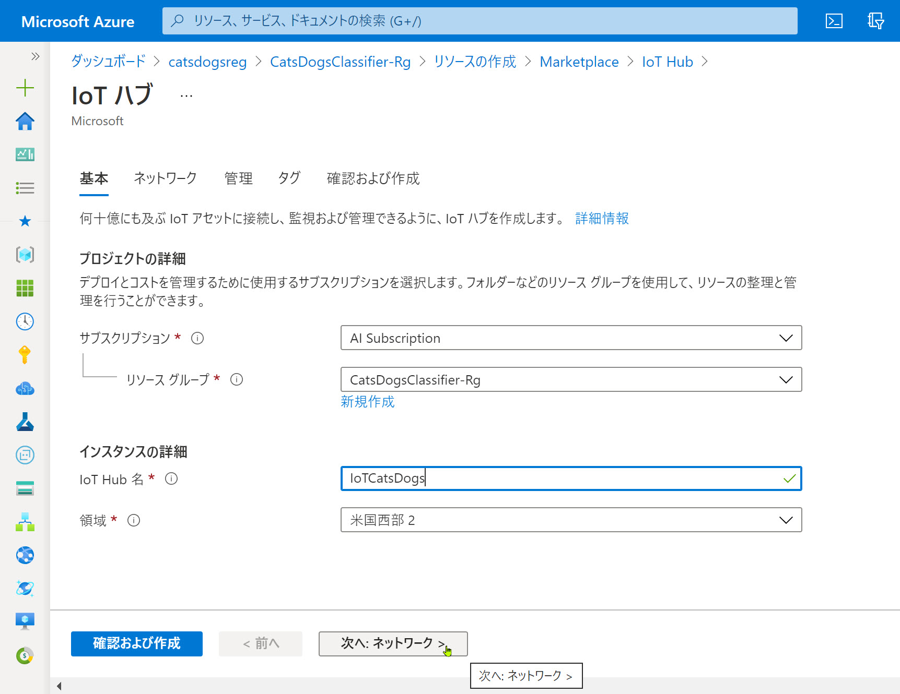
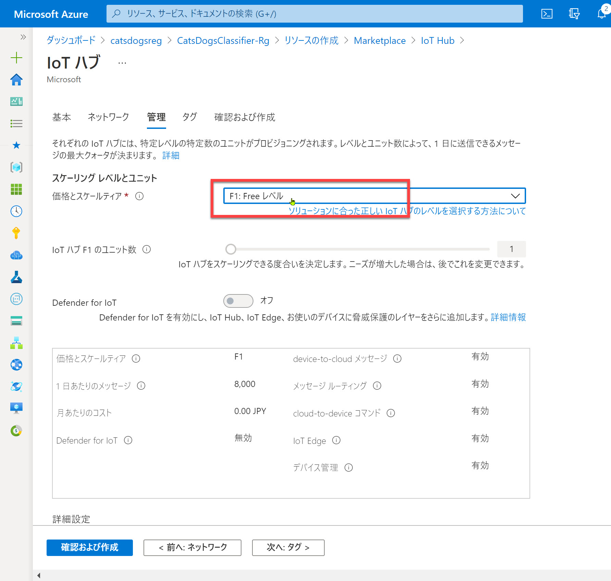
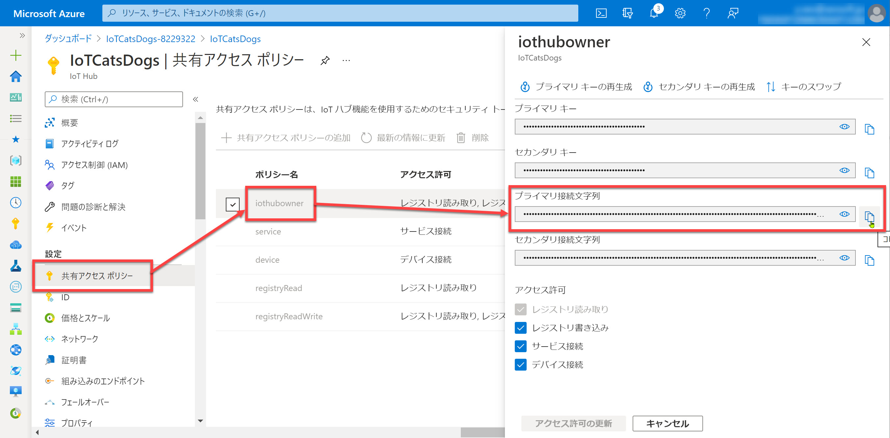
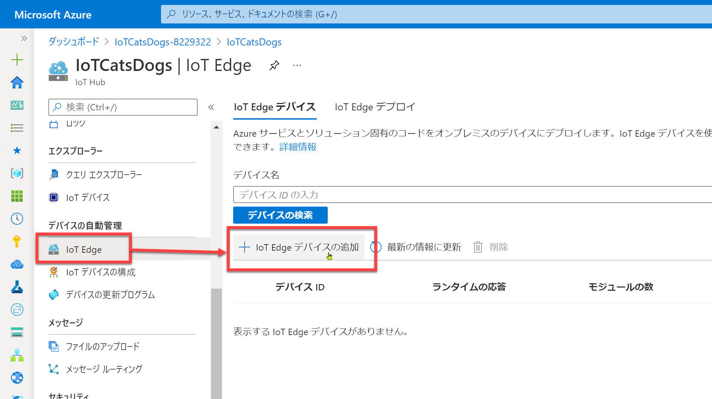
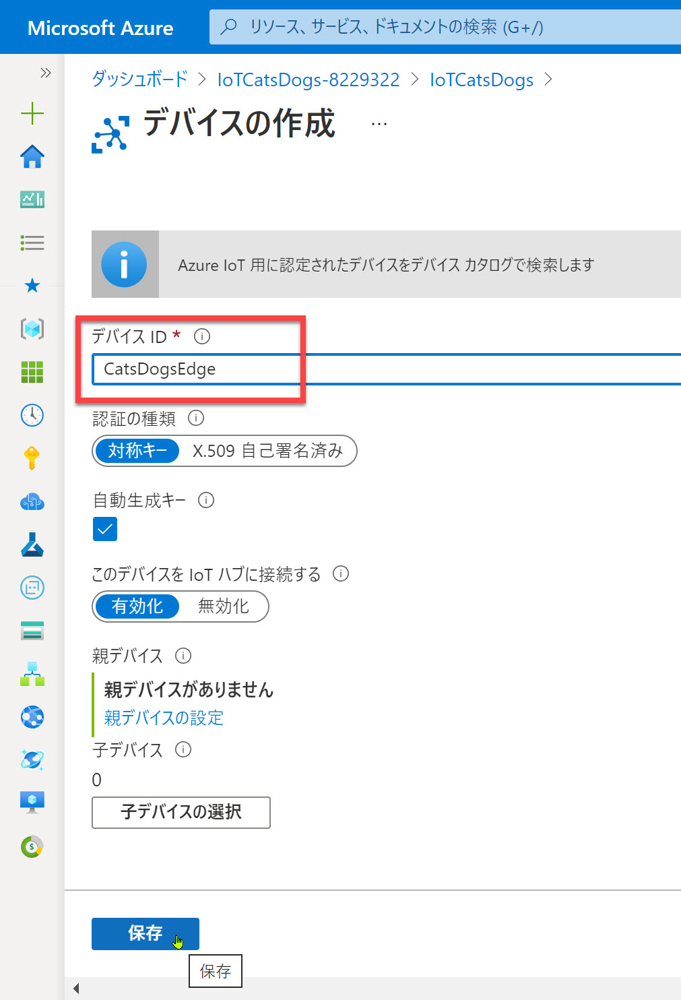
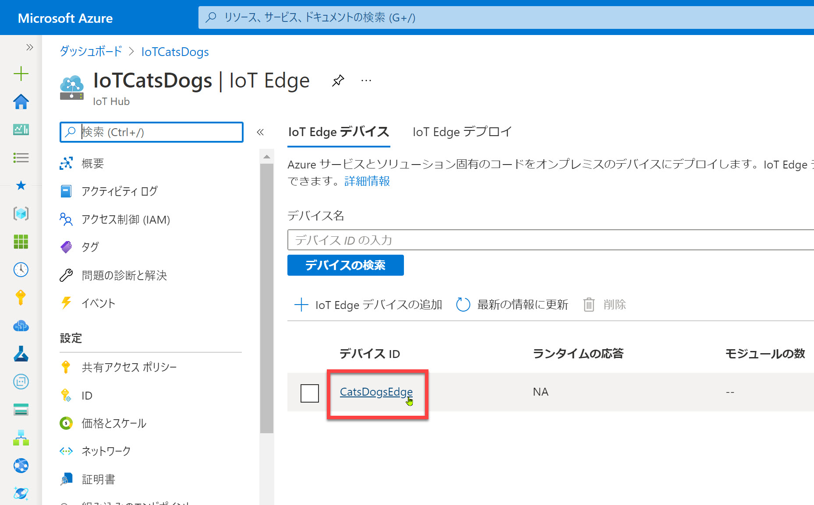
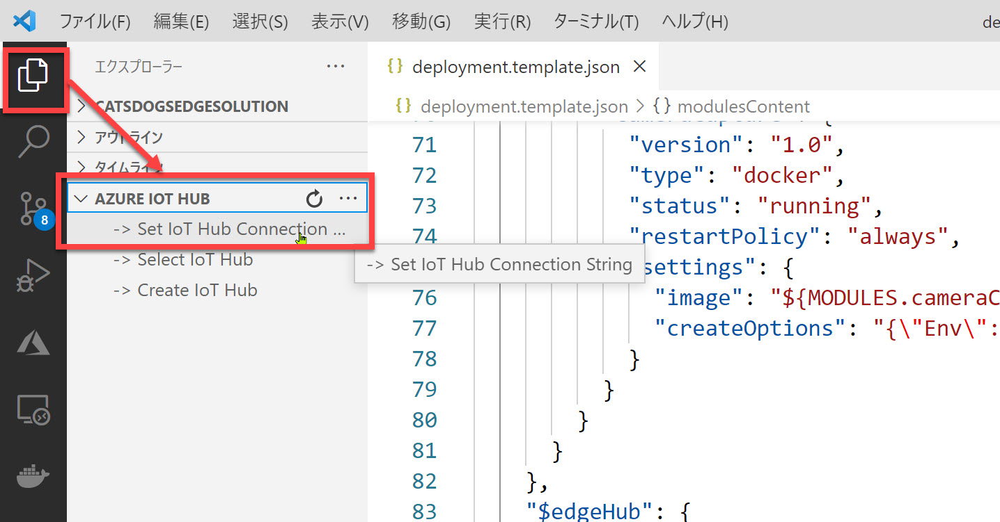
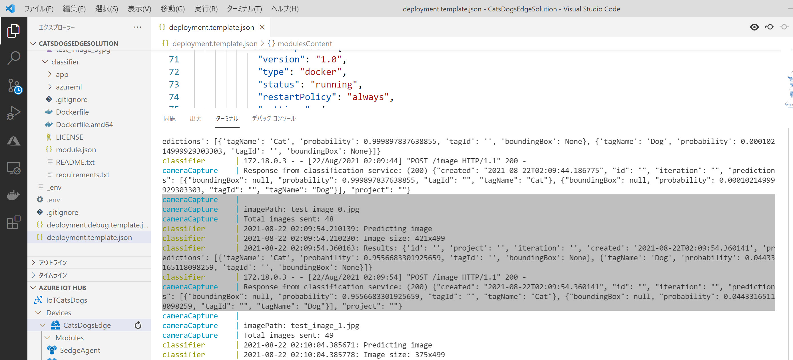
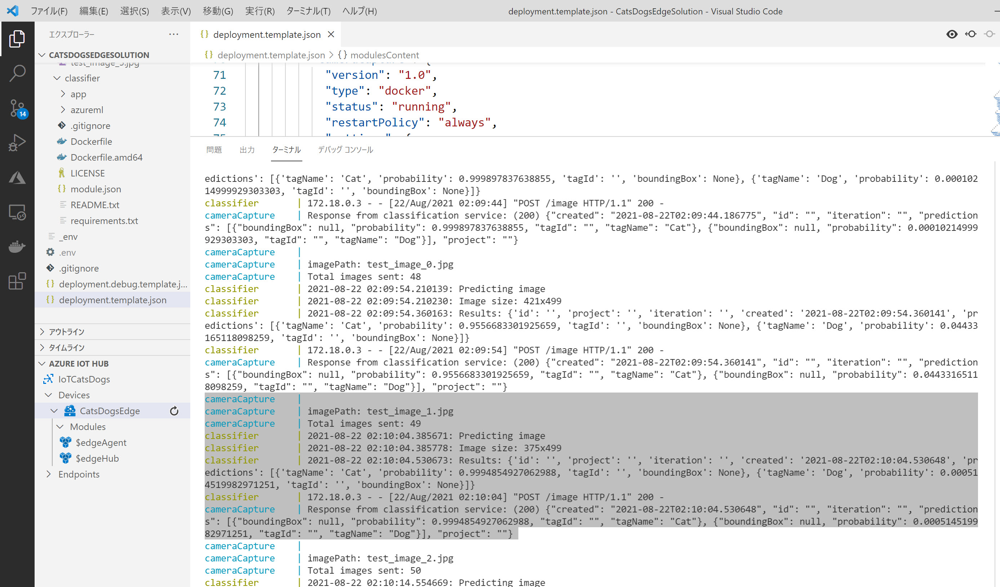

# IoT Hub / Edge デバイスの準備とソリューションのローカル実行

[前のステップ](./06_upload_to_acr.md) で、IoT Edge ソリューションを ACR に発行して、IoT Edge デバイスでソリューションを実行する準備ができました。

このステップでは、IoT Hub 作成、IoT Edge デバイス登録、ローカル PC のエミュレーターでソリューション実行を行います。

を行います。

[1. IoT Hub 作成](#iot-hub-%e4%bd%9c%e6%88%90)  
[2. IoT Edge デバイス登録](#iot-edge-%e3%83%87%e3%83%90%e3%82%a4%e3%82%b9%e7%99%bb%e9%8c%b2)  
[3. Visual Studio Code を IoT Hub に接続する](#visual-studio-code-%e3%82%92-iot-hub-%e3%81%ab%e6%8e%a5%e7%b6%9a%e3%81%99%e3%82%8b)  
[4. IoT Edge Simulator のセットアップ](#iot-edge-simulator-%e3%81%ae%e3%82%bb%e3%83%83%e3%83%88%e3%82%a2%e3%83%83%e3%83%97)  
[5. ローカル PC のエミュレーターでソリューション実行](#%e3%83%ad%e3%83%bc%e3%82%ab%e3%83%ab-pc-%e3%81%ae%e3%82%a8%e3%83%9f%e3%83%a5%e3%83%ac%e3%83%bc%e3%82%bf%e3%83%bc%e3%81%a7%e3%82%bd%e3%83%aa%e3%83%a5%e3%83%bc%e3%82%b7%e3%83%a7%e3%83%b3%e5%ae%9f%e8%a1%8c)

---

## IoT Hub 作成

[**IoT Hub**](https://azure.microsoft.com/ja-jp/services/iot-hub/) は Azure IoT の中心となるサービスです。  
デバイス（フィールド）とクラウドのサービスとを繋ぐものです。

IoT Hub はハブに接続する IoT Edge デバイスを一元管理し、IoT Edge モジュール（[前のステップ](./06_upload_to_acr.md) で ACR に発行したようなモジュール）をデバイスに同期することができます。

> IoT Hub は、IoT Edge デバイスの他に IoT デバイス管理も行いますが、今回のハンズオンの範囲を超えるので詳細は省略します。  
>
> 簡単には、
>
> - IoT デバイスとは一般的なマイコンボード等
> - IoT Edge デバイスとは IoT Edge ランタイムが動作するもの。  
> IoT Hub とより高度な連携や、本来クラウドで動作するサービスの一部を実行できるデバイス
>
> です。

1. Azure ポータルで "IoT Hub" リソースを新規作成します。

   

2. [**価格とスケールティア**] では "**S**" または "**F**" を選択します。  
   選択可能であれば無償の "**F1**" を選択、そうでなければ今回は "**S1**" で十分です。

   
    
   

3. IoT Hub が作成されたら、[**共有アクセスポリシー**] を選択します。  
   あとで使うので共有アクセスポリシーをメモ帳などにコピーしておきます。　　
   今回は簡単のため "**iothubowner**" を選択して "**接続文字列-プライマリキー**" をメモ帳などにコピーしておきます。

   

---

## IoT Edge デバイス登録

作成した IoT Edge ソリューションを実行する IoT Edge デバイスを IoT Hub に登録します。

1. [**IoT Edge**] を選択して [**IoT Edge デバイスを追加する**] を円卓します。

   > 名前は似ていますが "**IoT デバイス**" と "**IoT Edge**" デバイスとは違います。  
   > IoT デバイスはIoT Edge ランタイムを動作させないものです。

   

2. [**デバイス ID**] に名前を入れて保存します。  
   ここでは "**CatsDogsEdge**" とします。

   

3. 新規登録された "**CatsDogsEdge**" を選択します。

   

4. あとで使用するので [**プライマリ接続文字列**] をメモ帳などにコピーしておきます。  

   

   > "CatsDogsEdge" には、現在 2個のモジュールが登録されていることを確認しておきます。
   >
   > $edgeAgent ・・・IoT Edge デバイスの状態管理などを行うモジュール
   > $edgeHub ・・・モジュール間、および外部との通信を中継するモジュール

---

## Visual Studio Code を IoT Hub に接続する

Visual Studio Code を IoT Hub に接続します。  
これによって、IoT Edge デバイスへのモジュールの配置や IoT Hub のエンドポイントモニターなど、開発に便利な機能が使えるようになります。

1. Visual Studio Code で [AZURE IOT HUB] - [Set IoT Hub Connetion String] を選択します。

   

2. IoT Hub の接続文字列を入力します。

   > **IoT Edge デバイスの接続文字列** ではありません。

   

3. 接続されて IoT Hub および IoT Edge デバイスが見えることを確認します。

   

---

## IoT Edge Simulator のセットアップ

IoT Edge ソリューションをローカルで実行できるようにシミュレーターをセットアップします。

1. "IoT Edge デバイス名" (今回は "CatsDogsEdge") を選択して [**Setup IoT Edge Simulator**] を選択します。

   

2. ターミナルに "**Setup IoT Edge Simulator Successfully**" が表示されればセットアップ完了です。

   

---

## ローカル PC のエミュレーターでソリューション実行

IoT Edge ソリューションをローカル PC 上のエミュレーターで実行してみます。

1. Visual Studio Code のエクスプローラーで "**deployment.template.json**" を選択して、[**Build and Run IoT Edge Solution in Simulator**] を選択します。

   

2. IoT Edge Simulator が起動します。

   

3. 各モジュールの出力が表示されます。  
   "classfier" および "cameraCapture" の出力から画像分類の予測結果が分かります。  
   以下の例では "test_image_2.jpg" は "100% 猫である" ことが分かります。

   

   以下の例では "test_image_1.jpg" は "猫の可能性はほとんどない" ことが分かります。

   

4. シミュレーターを終了するには、ターミナルで **Ctrl + C** を押します。

---

以上で IoT Hub 作成、IoT Edge デバイス登録の手順が分かりました。  
またローカル PC 上のシミュレーターで IoT Edge ソリューションの実行方法が分かりました。

次のステップでは、IoT Edge デバイスを作成して、そのデバイス上で IoT Edge ソリューションを実行します。

[前に戻る](./06_upload_to_acr.md) | 次に進む  
[目次に戻る](../README.md)