# IoT Edge デバイスを作成する

前のステップまでで、IoT Edge ソリューションの開発からシミュレーターで実行することができました。

ハンズオンの最後に、IoT Edge デバイスで作成したソリューションを実行させます。

<br />

[1. IoT Edge ソリューションの展開](#iot-edge-%e3%82%bd%e3%83%aa%e3%83%a5%e3%83%bc%e3%82%b7%e3%83%a7%e3%83%b3%e3%81%ae%e5%b1%95%e9%96%8b)  
[2. 仮想マシン作成](#%e4%bb%ae%e6%83%b3%e3%83%9e%e3%82%b7%e3%83%b3%e4%bd%9c%e6%88%90)  
[3. IoT Edge デバイスに IoT Edge ランタイムをインストール](#iot-edge-デバイスに-iot-edge-ランタイムをインストール)  

<br />

---

## IoT Edge ソリューションの展開

IoT Edge ソリューションを展開します。  
エミュレーターに対してはすでに展開しているので、次は実際の IoT Edge デバイスで実行できるようにします。

1. Visual Studio Code のエクスプローラーで "**deployment.template.json**" を右クリックして [**Build and Push IoT Edge Solution**] を選択します。

   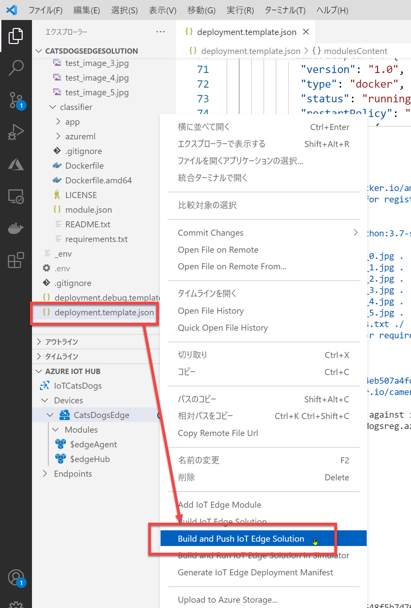

<br />

2. [AZURE IOT HUB] で "**IoT Edge デバイス名**" (今回は "CatsDogsEdge") を選択して [**1つの IoT Edge に配置**] を選択します。

   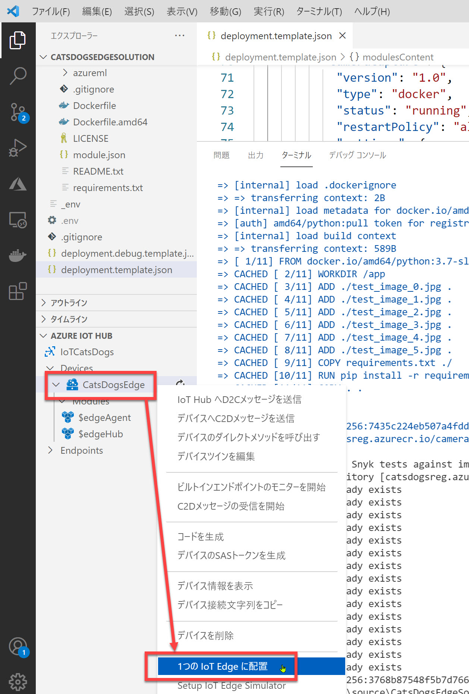

<br />

3. 配置用のマニフェストファイルを選択します。  
   今回は "**config\deployment.amd64.json**" を選択します。

   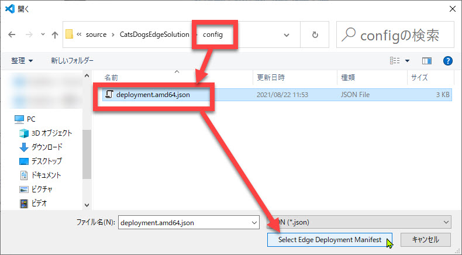  

   <br />

   > 前の手順ではマニフェストファイルのひな形 (deployment.template.json) を使いました。  
   > 今回は実際のデバイスへの配置なので、"deployment.**amd64**.json" を指定します。

<br />

---

## 仮想マシン作成

IoT Edge デバイスとして使用する仮想マシンを作成します。

1. Azure ポータルで新しい仮想マシンを作成します。  
   [**新しいリソース**] - [**Compute**] - [**仮想マシン**] を選択します。

   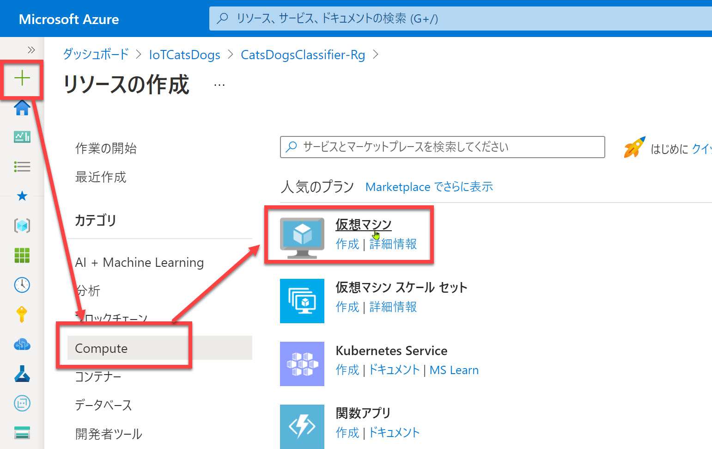

<br />

2.    [**仮想マシン名**] には任意の名前を入力します。ここでは "**CatsDogsEdgeVm**" とします。  
3. 仮想マシンの作成で [**イメージ**] の [**すべてのパブリックおよびプライベートイメージを参照する**] を選択します。

   

<br />

4. イメージ選択では、検索ボックスに "**canonical**" と入力して "**Ubuntu Server 18.04 LTS**" を探します。  
   さらに [**選択**] を開いて "**Ubuntu Server 18.04 LTS - Get 2**" を選択します。

   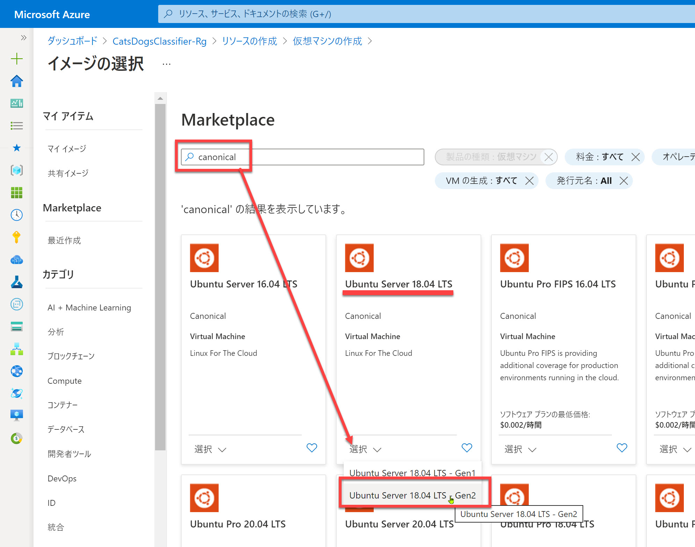  

   > Ubuntu のイメージは多数あるので検索の際は "canonical" と入力すると簡単に見つけられます。

   > 2021年8月時点では、マイクロソフトから公開されている IoT Edge for Linux のインストールパッケージは以下の 2つです。  
   > - Ubuntu Server 18.04 LTS
   > - Raspberry Pi OS Stretch
   >
   > このため今回は必ず "Ubuntu Server 18.04 LTS" を選択します。

<br />

1. [**すべてのサイズを表示**] を選択してサイズを選択します。  
   [**VM サイズの選択**] では [**B シリーズ**] を展開して "**Standard B1ms**" を選択します。  
   最後に [選択] をクリックします。

   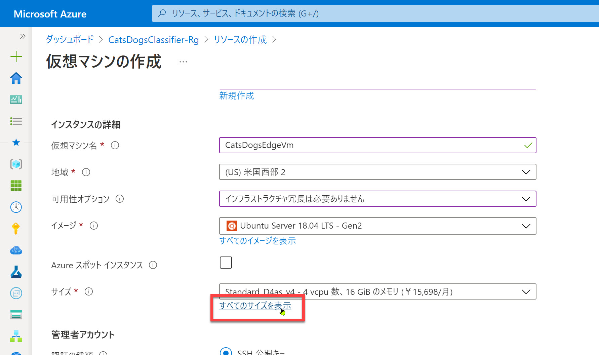  
   <br />
   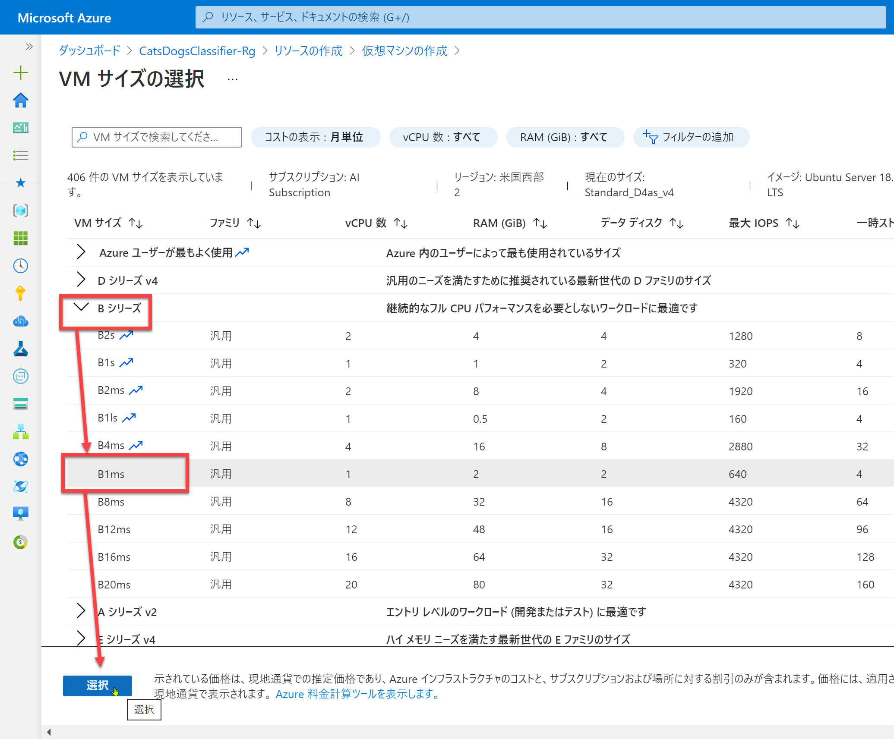

<br />

6. 管理者アカウントを作成します。  
   任意のユーザー名、パスワードを入力します。

7. (オプション) ディスクのパフォーマンスは特に必要ないので [**ディスク**] で "**Standard SSD**" を選択します。  
   ただしこの選択は必須ではありません。  
   
   

<br />

8. 最後に仮想マシン作成のブレードで [**確認および作成**] をクリックして仮想マシンを作成します。  
   
   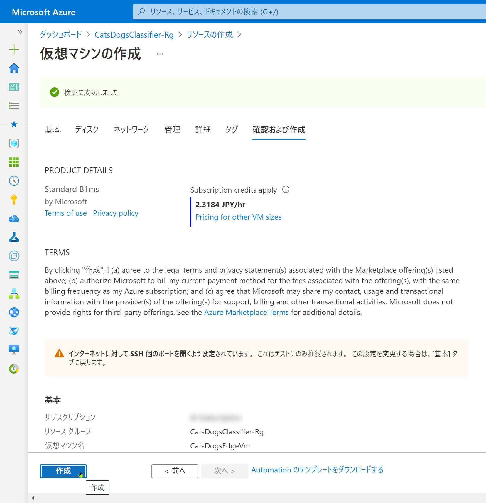

<br />

9.  仮想マシンが作成されたら、**IP アドレス** をコピーします。  
    
    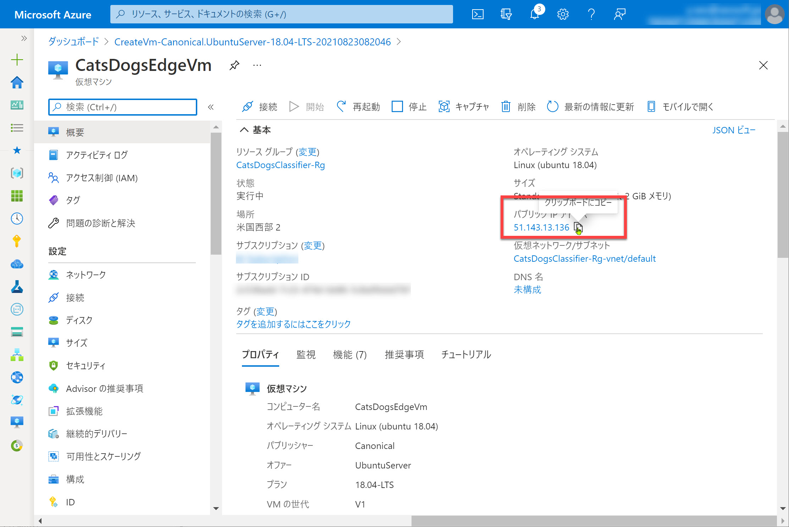

<br />

---

## IoT Edge デバイスに IoT Edge ランタイムをインストール

デバイスの代わりとして作成した仮想マシンに IoT Edge ランタイムをインストールします。

1. ターミナルアプリ（Windows ではコマンドプロンプト、PowerShell、Windows ターミナルなど）で、IoT Edge デバイス（仮想マシン） に ssh でログインします。

   ```cmd
   ssh <仮想マシンのユーザー名>@<仮想マシンのIPアドレス>
   ```

   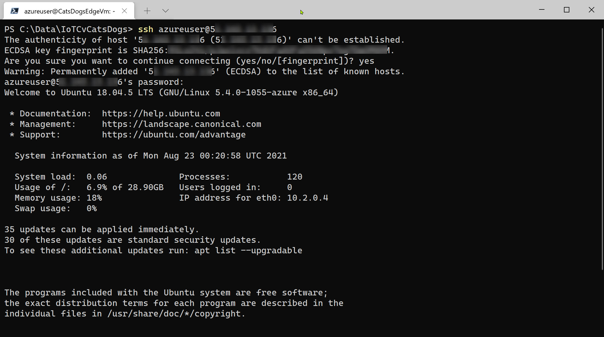

<br />

2. リポジトリ構成をインストールします。  

   ```cmd
   curl https://packages.microsoft.com/config/ubuntu/18.04/multiarch/prod.list > ./microsoft-prod.list
   ```

3. リポジトリ構成のリストを sources.list.d ディレクトリにコピーします。  

   ```cmd
   sudo cp ./microsoft-prod.list /etc/apt/sources.list.d/
   ```

4. GPG 公開キーをインストールします。  

   ```cmd
   curl https://packages.microsoft.com/keys/microsoft.asc | gpg --dearmor > microsoft.gpg  
   sudo cp ./microsoft.gpg /etc/apt/trusted.gpg.d/
   ```

   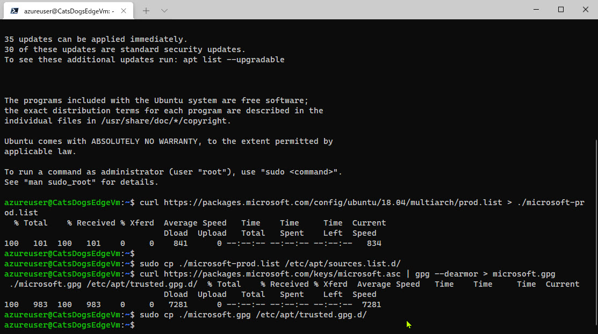

<br />

5. デバイスのパッケージリストを更新します。  
   
   ```cmd
   sudo apt-get update
   ```

6. Moby エンジンをインストールします。  

   ```cmd
   sudo apt-get install moby-engine
   ```

   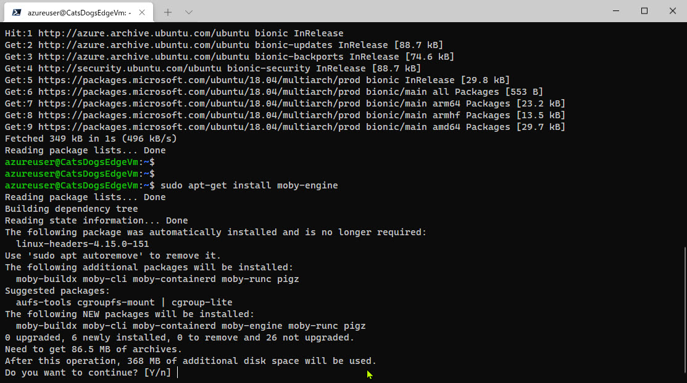  
   
   <br />   
   
   > Moby エンジンとはオープンソース版の Docker のコア部分です。

<br />

---

ソリューションを実行するための仮想マシンの作成ができました。

次のステップでは最後の手順として、作成済みのソリューションをここで作成した仮想マシンで実行します。

[前に戻る](./08_prepare_edgedevice.md)| [次に進む](./09_run_on_edgedevice.md)  
[目次に戻る](./README.md)