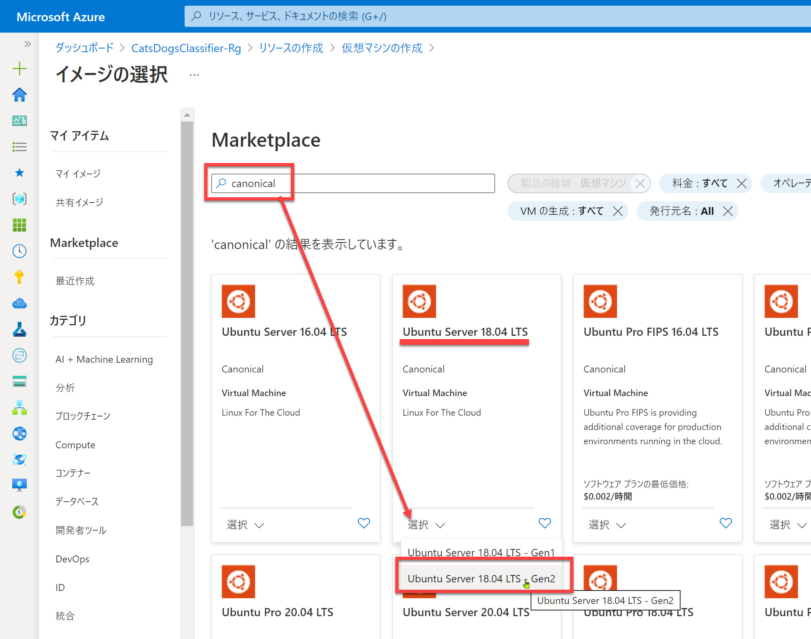
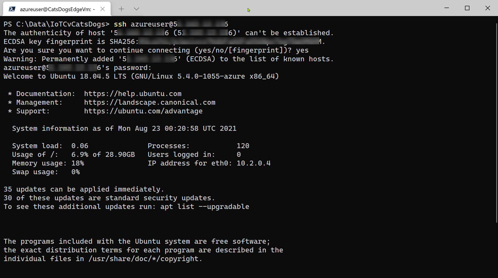

# IoT Edge デバイスでソリューション実行

前のステップまでで、IoT Edge ソリューションの開発からシミュレーターでの実行までできました。

ハンズオンの最後に、IoT Edge デバイスで、作成したソリューションを実行させます。

[1. IoT Edge ソリューションの展開](#iot-edge-%e3%82%bd%e3%83%aa%e3%83%a5%e3%83%bc%e3%82%b7%e3%83%a7%e3%83%b3%e3%81%ae%e5%b1%95%e9%96%8b)  
[2. 仮想マシン作成](#%e4%bb%ae%e6%83%b3%e3%83%9e%e3%82%b7%e3%83%b3%e4%bd%9c%e6%88%90)  
[3. IoT Edge デバイス（仮想マシン）でソリューション実行](#iot-edge-%e3%83%87%e3%83%90%e3%82%a4%e3%82%b9%e4%bb%ae%e6%83%b3%e3%83%9e%e3%82%b7%e3%83%b3%e3%81%a7%e3%82%bd%e3%83%aa%e3%83%a5%e3%83%bc%e3%82%b7%e3%83%a7%e3%83%b3%e5%ae%9f%e8%a1%8c)  
[4. Visual Studio Code で IoT Edge のモニタリング](#visual-studio-code-%e3%81%a7-iot-edge-%e3%81%ae%e3%83%a2%e3%83%8b%e3%82%bf%e3%83%aa%e3%83%b3%e3%82%b0)  
[5. ハンズオンの後始末](#%e3%83%8f%e3%83%b3%e3%82%ba%e3%82%aa%e3%83%b3%e3%81%ae%e5%be%8c%e5%a7%8b%e6%9c%ab)

---

## IoT Edge ソリューションの展開

IoT Edge ソリューションを展開します。  
エミュレーターに対してはすでに展開しているので、実際の IoT Edge デバイスでも実行できるようにします。

1. Visual Studio Code のエクスプローラーで

   

2. [AZURE IOT HUB] で "**IoT Edge デバイス名**" (今回は "CatsDogsEdge") を選択して [**1つの IoT Edge に配置**] を選択します。

   

3. 配置用のマニフェストファイルを選択します。  
   今回は "**config\deployment.amd64.json**" を選択します。

   

   > 前の手順ではマニフェストファイルのひな形 (deployment.template.json) を使いました。  
   > 今回は実際のデバイスへの配置なので、"deployment.**amd64**.json" を指定します。

---

## 仮想マシン作成

IoT Edge デバイスとして使用する仮想マシンを作成します。  
Azure には IoT Edge ランタイムがインストールされたイメージが公開されています。今回はこれを使います。

1. Azure ポータルで新しい仮想マシンを作成します。  
   [**仮想マシン名**] には任意の名前を入力します。ここでは "**CatsDogsEdgeVm**" とします。  
   [**新しいリソース**] - [**Compute**] - [**Virtual machine**] を選択します。

   

2. 仮想マシンの作成で [**イメージ**] の [**すべてのパブリックおよびプライベートイメージを参照する**] を選択します。

   

3. イメージ選択では、検索ボックスに "iot edge" と入力して "**Ubuntu Server 17.04 LTS + Azure IoT Edge runtime**" を選択します。

   

4. サイズが自動的に "Standard B1ms" に変更されています。  
   その他、適切に設定して仮想マシンを作成します。

   

5. 仮想マシンが作成されたら、**IP アドレス** をコピーします。

---

## IoT Edge デバイス（仮想マシン）でソリューション実行

1. Windows のコマンドプロンプト（他の OS ではターミナルアプリ）で、IoT Edge デバイス（仮想マシン） に ssh でログインします。

   ```cmd
   ssh <仮想マシンのユーザー名>@<仮想マシンのIPアドレス>
   ```
   

2. IoT Edge デバイスで以下のコマンドを順に実行します。

   ```cmd
   sudo /etc/iotedge/configedge.sh '<IoT Edge デバイスの接続文字列>'
   sudo systemctl restart iotedge
   sudo systemctl status iotedge
   ```

   > 1行目の "**configedge.sh**" で、このデバイスを IoT Hub 管理下の Edge デバイスとして登録します。
   >
   > 3行目でステータスを表示した後は "q" でプロンプトに戻ります。

   /

3. 以下のコマンドで 4つのモジュールがすべて "**running**" になるのを確認します。  
   すべてのモジュールが起動するまでに最大で数分程度かかるかもしれません。

   ```cmd
   sudo iotedge list
   ```

   

4. 以下のコマンドで "**cameraCapture**" のログを確認します。

   ```cmd
   iotedge logs cameraCapture -f
   ```

   

---

## Visual Studio Code で IoT Edge のモニタリング

IoT Hub に送信されてくる IoT Edge デバイスのメッセージは Visual Studio Code でモニタリングできます。

1. Visual Studio Code の [AZURE IOT HUB] で "**IoT Edge デバイス名**" (今回は "CatsDogsEdge") を選択して [**ビルトインエンドポイントのモニターを開始**] を選択します。

   

2. Visual Studio Code の出力に IoT Edge デバイスのメッセージが表示されることを確認します。

   

   > モニタリングを終了するには Visual Studio Code の [**Stop Monitoring built-in event endpoint**] をクリックします。
   >
   > 

---

## ハンズオンの後始末

ハンズオンの全ての手順が終わりました。  
後始末をします。

1. IoT Edge デバイス（仮想マシン）の割り当て解除
2. (オプション) 開発用の仮想マシンを作成した場合は、このマシンの割り当て解除
3. (オプション) ハンズオンで使用したリソースをすべて削除したい場合は、リソースグループの削除

---

以上で、Azure IoT Edge ＋ Custom Vision を使ってエッジデバイスで画像分類するアプリケーション開発は終了です。  
おつかれさまでした。

[前に戻る](./07_create_iothub_edgedevice.md)  
[目次に戻る](./README.md)