# IoT Edge デバイスでソリューション実行

前のステップまでで、

- Custom Vision で画像分類器を作成
- IoT Edge ソリューションの開発
- ローカルのシミュレーターで実行
- デバイスとして使用する加増マシンを作成

しました。

ハンズオンの最後に、作成したソリューションをIoT Edge デバイス上で実行させます。

<br />

[1. IoT Edge のインストール](#iot-edge-のインストール)  
[2. IoT Edge デバイス（仮想マシン）でソリューション実行](#iot-edge-デバイス仮想マシンでソリューション実行)  
[3. Visual Studio Code で IoT Edge のモニタリング](#visual-studio-code-で-iot-edge-のモニタリング)  
[4. ハンズオンの後始末](#ハンズオンの後始末)

<br />

---

## IoT Edge のインストール

[前のステップ](./08_prepare_edgedevice.md) でデバイスを用意できました。

このデバイスに IoT Edge をインストールします。

1. デバイスのパッケージリストを更新します。  

   ```cmd
   sudo apt-get update
   ```

2. (オプション) 使用できる IoT Edge のバージョンを確認します。  

   ```cmd
   apt list -a aziot-edge
   ```

   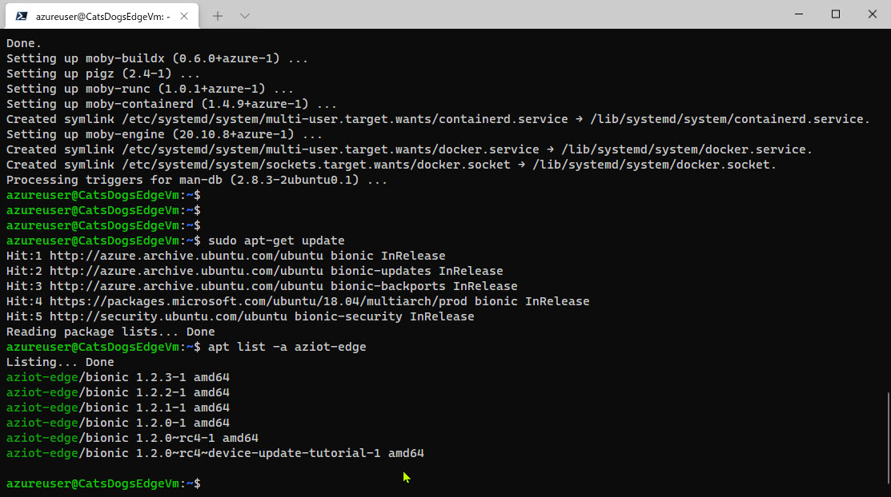

3. IoT Edge の最新版をインストールします。  

   ```cmd
   sudo apt-get install aziot-edge
   ```

   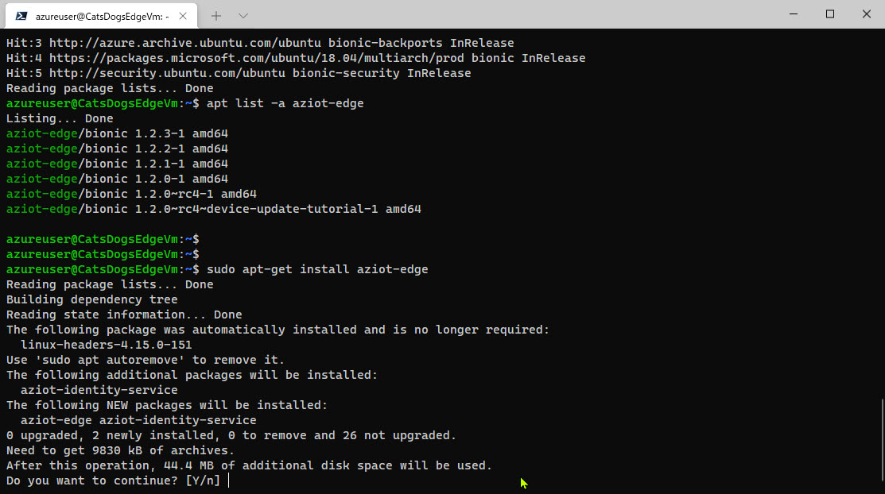  
   <br />
   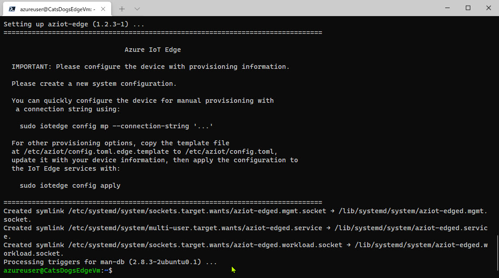  

   <br />

   > 最新版に不具合が見つかった場合などはバージョン指定して古いものをインストールすることができます。  
   > 例えば以下のようにします。
   >
   > ```cmd
   > sudo apt-get install aziot-edge=1.2* aziot-identity-service=1.2*
   > ```
   
<br />

4. テンプレートからデバイスの構成ファイルを作成します。  

   ```cmd
   sudo cp /etc/aziot/config.toml.edge.template /etc/aziot/config.toml
   ```

5. 構成ファイルを編集します。  

   ```cmd
   sudo nano /etc/aziot/config.toml
   ```

   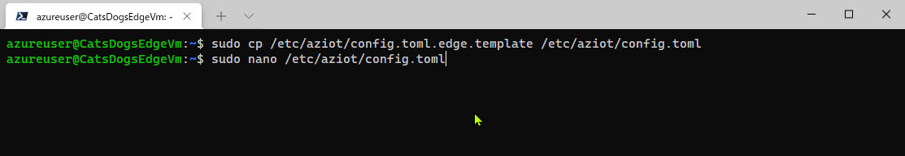  

<br />

6. エディターが開いたら [**provisioning**] セクションを探して、3行のコメントを外します。  
   さらに [connection_string] に IoT Edge デバイスの接続文字列を入力します。  
   編集できたら、Ctrl + x, y, Enter でエディターを閉じます。

   > IoT Edge デバイスの接続文字列は [**IoT Edge デバイス登録**](./07_create_iothub_edgedevice.md) で確認した値です。  
   > IoT Hub の接続文字列ではないので注意してください。

   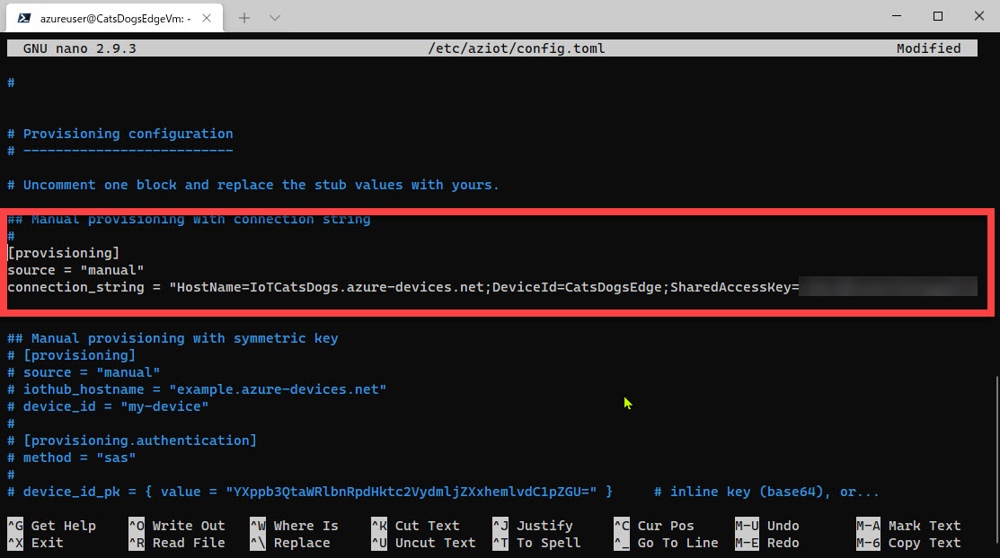  

<br />

7. 構成ファイルの変更を適用します。  

   ```cmd
   sudo iotedge config apply
   ```

   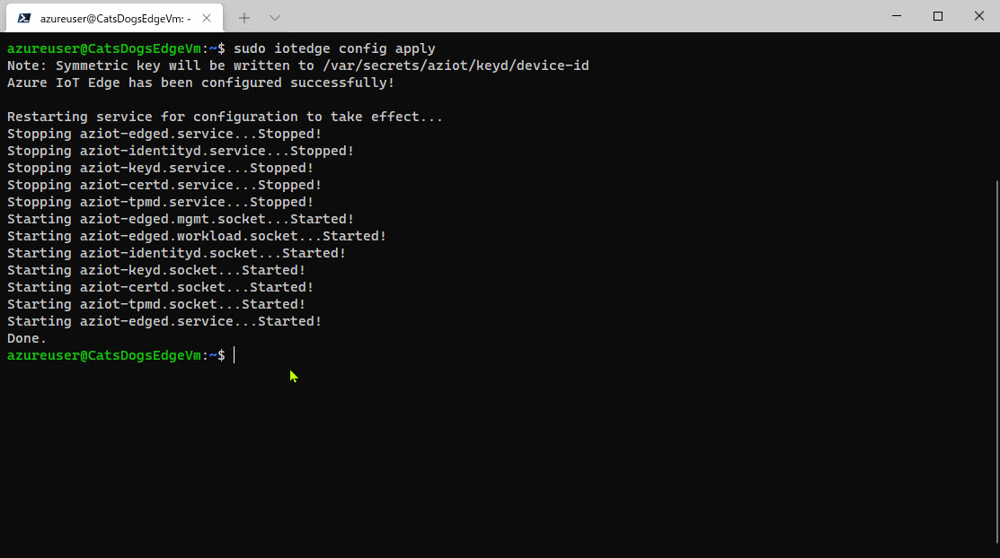  

<br />

8. IoT Edge が動作していることを確認します。  

   ```cmd
   sudo iotedge system status
   ```

   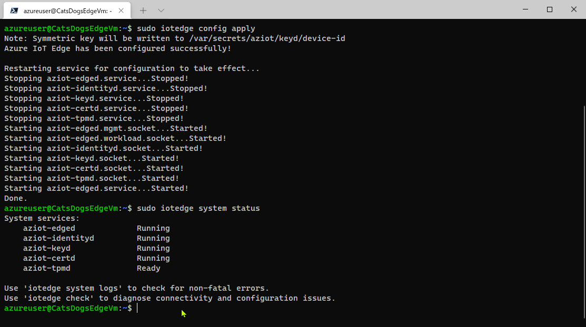  

<br />

9. デバイスの構成および接続状態を確認します。  

   ```cmd
   sudo iotedge check
   ```

   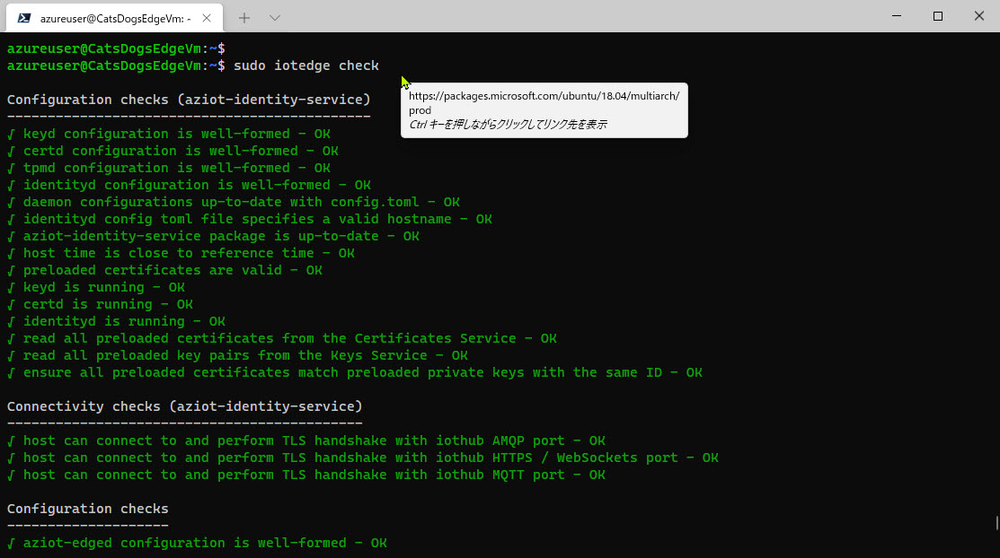  

<br />

ここまでで IoT Edge デバイスの構成が完了しました。  
続いて、デバイスの動作状態を確認します。

<br />

---

## IoT Edge デバイス（仮想マシン）でソリューション実行

1. 以下のコマンドで 4つのモジュールがすべて "**running**" になるのを確認します。  
   すべてのモジュールが起動するまでに最大で数分程度かかるかもしれません。

   ```cmd
   sudo iotedge list
   ```

   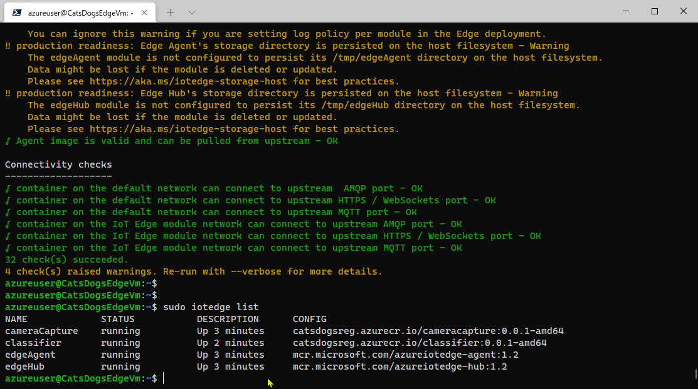

<br />

2. 以下のコマンドで "**cameraCapture**" のログを確認します。   
   Edge デバイスが動作して、テスト画像を猫か犬かに分類していることが分かります。

   ```cmd
   iotedge logs cameraCapture -f
   ```

   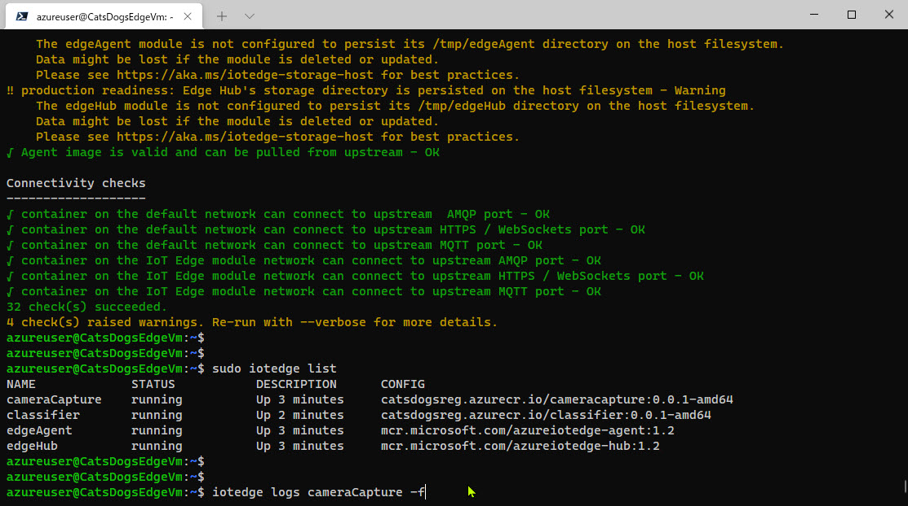  
   <br />
   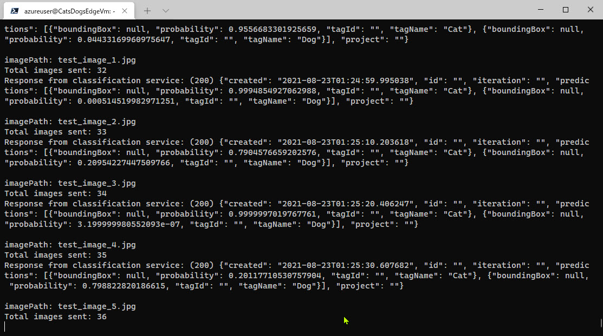  

<br />

---

## Visual Studio Code で IoT Edge のモニタリング

IoT Hub に送信されてくる IoT Edge デバイスのメッセージは Visual Studio Code でもモニタリングできます。

1. Visual Studio Code のエクスプローラーの [AZURE IOT HUB] で [**Endpoints**] - [**Build-in endpoints**] を右クリックして [**モニターを開始**] を選択します。

   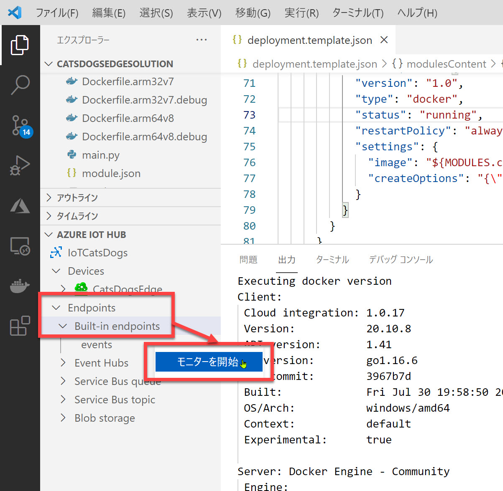

<br />

2. Visual Studio Code の出力に IoT Edge デバイスのメッセージが表示されることを確認します。

   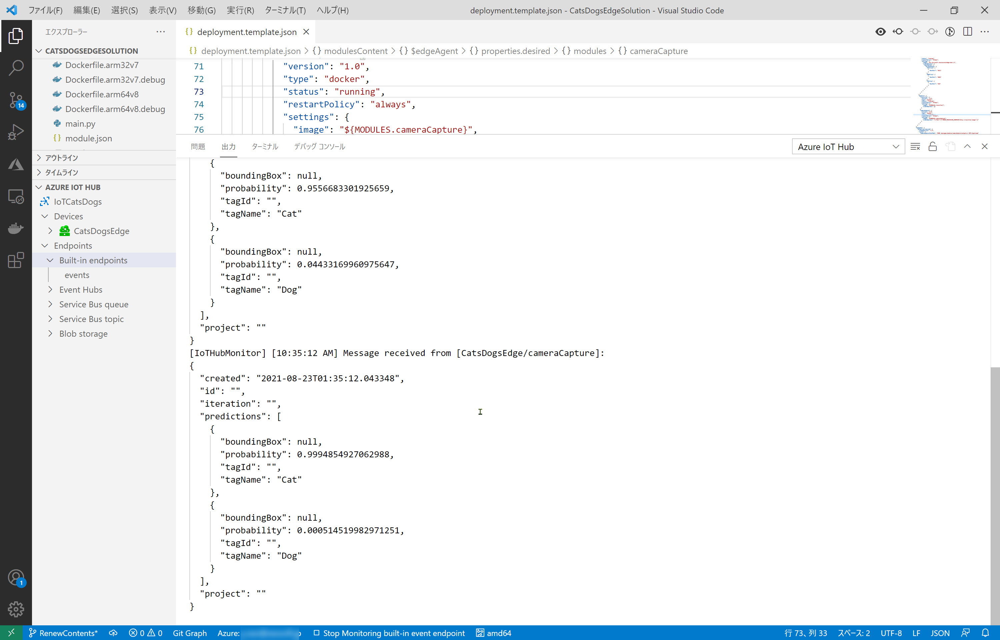

<br />

3. モニタリングを終了するには Visual Studio Code の [**Stop Monitoring built-in event endpoint**] をクリックします。  

   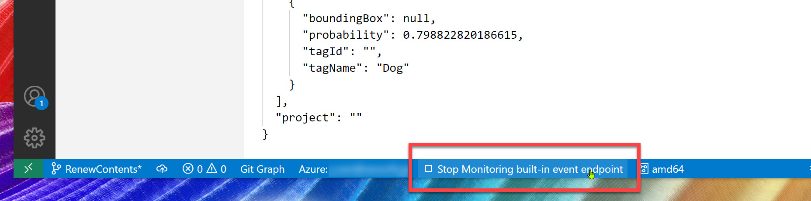

<br />

おつかれさまでした。以上で IoT Edge デバイスで画像分類器を動作させることができました。  
すべての操作ができたら、以降は不要な課金がないように作成したリソースを削除します。  
(必要ならばすぐに削除せずに動作させ続けてください)

<br />

---

## ハンズオンの後始末

ハンズオンの全ての手順が終わりました。  
後始末をします。

1. IoT Edge デバイス（仮想マシン）の割り当て解除
2. (オプション) 開発用の仮想マシンを作成した場合は、このマシンの割り当て解除
3. (オプション) ハンズオンで使用したリソースをすべて削除したい場合は、リソースグループの削除

<br />

---

以上で、Azure IoT Edge ＋ Custom Vision を使って Edge デバイスで画像分類するアプリケーション開発は終了です。  
おつかれさまでした。

[前に戻る](./08_prepare_edgedevice.md)  
[目次に戻る](./README.md)