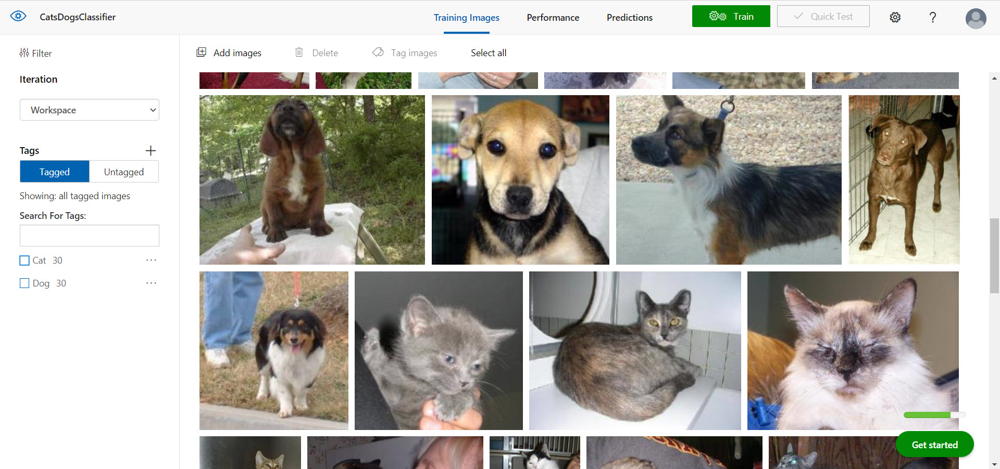
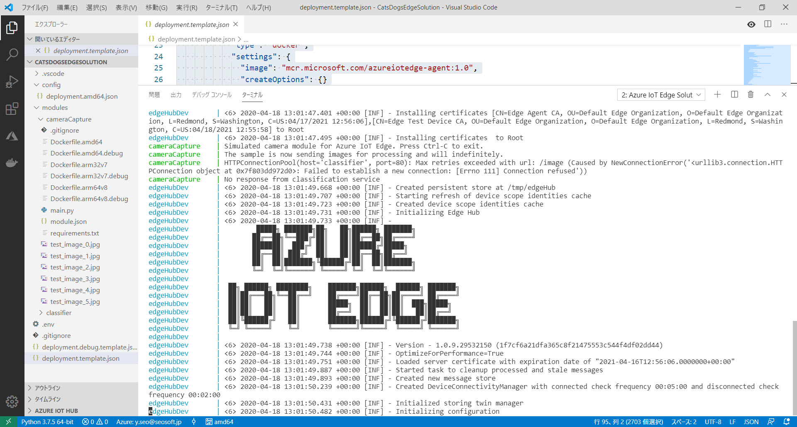

# 【開発手順のハンズオン】Azure IoT Edge + Custom Vision を使ってエッジデバイスで画像分類するアプリケーション

Azure IoT Edge ＋ Custom Vision を使ってエッジデバイスで画像分類するアプリケーションを開発するために利用してください。

開発環境の構築からアプリケーション実行方法・動作確認方法までの一連の流れを体験できます。

1. [開発環境の構築](./01_install.md)
2. [Custom Vision で画像分類器の作成](./02_custom_vision.md)
3. [IoT Edge ソリューションの作成](./03_create_edgeapp.md)
4. [予測サービスモジュールの編集](./04_edit_classfier.md)
5. [カメラモジュールの作成](./05_create_cameramodule.md)
6. [Container Registry にモジュールをアップロード](./06_upload_to_acr.md)
7. [IoT Hub / Edge デバイスの準備とソリューションのローカル実行](./07_create_iothub_edgedevice.md)
8. [IoT Edge デバイスでソリューションを実行する](./08_run_on_edgedevice.md)

 

 

---

このハンズオンは、[Azure IoT Edge の公式チュートリアル](https://docs.microsoft.com/ja-jp/azure/iot-edge/tutorial-deploy-custom-vision) を元に、

- 手順の整理
- 手順の追加
- アプリケーションのソースコードを一部改訂

をしました。

このハンズオンでは、物理デバイスを使用せずに **カメラのシミュレーター**を使います。  
物理デバイスを持っていなくてもアプリケーションを開発することができ、Costom Vision と IoT Edge、Azure IoT を理解できます。
