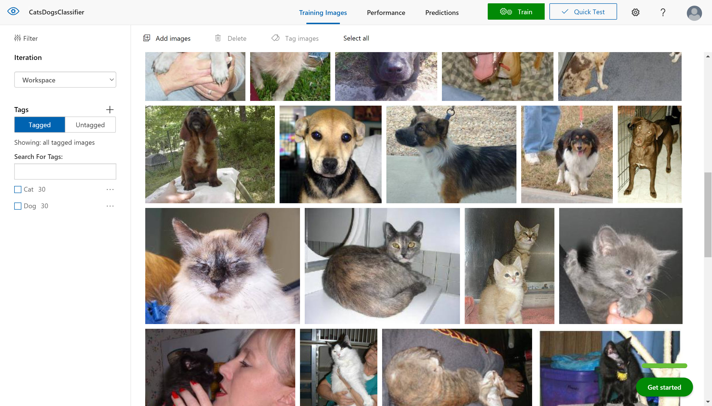

# 【開発手順のハンズオン】Azure IoT Edge + Custom Vision を使ってエッジデバイスで画像分類するアプリケーション

Azure IoT Edge ＋ Custom Vision を使ってエッジデバイスで画像分類するアプリケーションを開発するために利用してください。

開発環境の構築からアプリケーション実行方法・動作確認方法までの一連の流れを体験できます。

1. [開発環境の構築](./01_install.md)
2. [Custom Vision で画像分類器を作成](./02_custom_vision.md)
3. [IoT Edge ソリューションを作成](./03_create_edgeapp.md)
4. [classifier モジュールを編集](./04_edit_classfier.md)
<!-- 5. [カメラモジュールを作成](./05_create_cameramodule.md) -->
<!-- 6. [Container Registry にモジュールをアップロード](./04_upload_to_acr.md) -->

---

このハンズオンは、[Azure IoT Edge の公式チュートリアル](https://docs.microsoft.com/ja-jp/azure/iot-edge/tutorial-deploy-custom-vision) を元に、

- 手順の整理
- 手順の追加
- アプリケーションのソースコードを一部改訂

しました。
